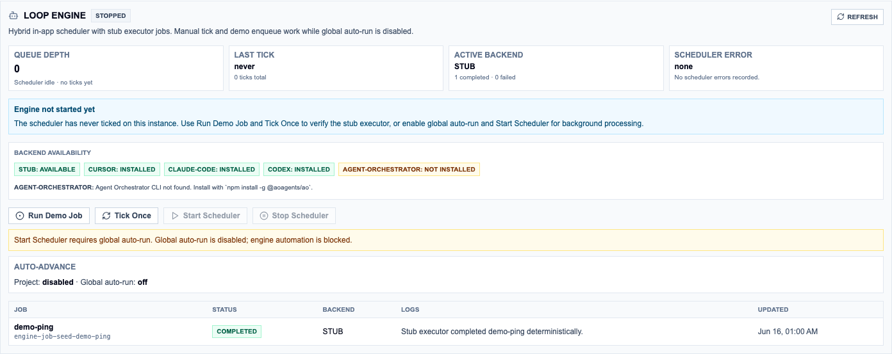

# Loop Control Plane

A local-first control plane for AI–human collaborative software development. Loop Control Plane gives you one place to plan features, break work into tasks, track progress on a kanban board, and hand off to AI agents — with explicit approval gates so automation never runs ahead of you.


## What This Is

Loop Control Plane is a Next.js web app that sits between **planning** (Spec Kit artifacts, PRDs, task checklists) and **execution** (Cursor, Claude Code, Codex, Agent Orchestrator). It is not an AI agent itself. It is the operator console: the board where you decide what gets built, who works on it, and when automation is allowed to act.

Think of it as three layers:

| Layer | What it does |
|-------|--------------|
| **Planning surface** | Track features through PRD → spec → plan → tasks; edit markdown artifacts in the browser |
| **Kanban board** | Manage task cards across a 9-column lifecycle with drag-and-drop, filters, and a full event timeline |
| **Execution bridge** | Generate handoff files, create GitHub issues, sync PR/CI status, and run workflow pipelines through the Loop Engine |

Everything persists locally in SQLite. GitHub integration is optional but unlocks issue creation, PR tracking, and Agent Orchestrator handoff.

## How It Works

### The core loop

```
Feature brief → Spec Kit artifacts → Import tasks → Kanban board → AI execution → Review → PR → Done
```

1. **Create a project** linked to a local Git repository.
2. **Create a feature** to group related work under a shared artifact lifecycle.
3. **Produce or import tasks** — manually, from a `tasks.md` checklist, or via a workflow run.
4. **Move tasks across the board** — Backlog through Done — assigning work to yourself or to AI.
5. **Hand off to agents** when ready. Loop Control Plane generates context files and, with GitHub connected, can label issues `ao-ready` for Agent Orchestrator pickup.
6. **Review and close** — sync PR/CI status back to cards, mark tasks done, advance the feature.

### Kanban columns

Tasks flow through nine columns:

`Backlog` → `Spec Review` → `Plan Review` → `Ready` → `AI Running` → `Human Working` → `Needs Review` → `Blocked` → `Done`

Each card carries an **owner** (Unassigned / AI / Human / Pairing), a **risk level** (low / medium / high / critical), and a **mode** (Spec / Plan / Execute / Review / Handoff). Risk level controls what automation is allowed to do without your explicit approval.

### Feature lifecycle

Features track artifact completeness across five files:

`PRD.md` → `spec.md` → `plan.md` → `tasks.md` → `decisions.md`

Status progresses: PRD Draft → Spec Review → Spec Approved → Plan Review → Plan Approved → Tasks Ready → In Execution → Done.

### Workflow pipelines

The **Workflow Editor** is a React Flow canvas where you define multi-step delivery pipelines as a graph of nodes — for example: human input → Spec Kit generation → human review → import tasks → implement → run tests → open PR → merge.

The **Workflow Runner** executes one node at a time. Human and semi-auto nodes pause until you approve. Auto nodes advance when policy allows. Merge and other hard-stop nodes never auto-execute.

A ready-made example ships at `examples/workflows/feature-development-loop.json`.

### Loop Engine

The **Loop Engine** is an in-app job scheduler that runs inside the Next.js process. It dequeues persisted jobs from SQLite, dispatches them to executor backends, and records redacted logs.

| Backend | Role |
|---------|------|
| `stub` | Deterministic test/demo executor (always available) |
| `cursor` | Cursor CLI |
| `claude-code` | Claude Code non-interactive mode |
| `codex` | Codex CLI |
| `agent-orchestrator` | Agent Orchestrator spawn/poll handoff |

Workflow steps and individual task runs enqueue jobs like `workflow-step` and `task-run`. The dashboard **Loop Engine** panel shows queue depth, job details, 24h metrics, and operator controls (retry, cancel, resume).

**Global auto-run is off by default.** When enabled, the scheduler ticks every 3 seconds and can chain workflow steps until a human gate or hard stop. High and critical risk tasks, and merge nodes, are always blocked from unattended execution regardless of settings.

## Quick Start

**Prerequisites:** Node.js 20+ and npm.

```bash
git clone https://github.com/BankNatchapol/Loop-Control-Plane.git
cd Loop-Control-Plane
npm install
npm run db:migrate    # creates data/loopboard.sqlite
npm run dev           # http://localhost:3000
```

Optional seed data: `npm run db:seed`

### Managed Agent Orchestrator development

This repository pins the customized Agent Orchestrator fork as a git submodule.
Initialize and build it once:

```bash
npm run ao:setup
```

Then start both applications under one lifecycle supervisor:

```bash
npm run dev:managed
```

Open **http://localhost:3100** as the operator console. AO runs headless in the background (REST API on port 3000, terminal mux proxied on port 31101). Startup clears stale AO runtimes from interrupted runs.
Stopping either child, or pressing Ctrl-C in the managed terminal, stops both
services and removes every AO session runtime and managed worktree.

### Five-minute walkthrough (no GitHub required)

**1. Create a test repo**

```bash
mkdir ~/my-test-project && cd ~/my-test-project && git init
```

**2. Create a project** — open the app, click **+ Add project**, set Name and Repository Path (absolute path to your repo), click **Create Project**.

**3. Create a feature** — click **+ Add feature**, give it a name and summary, click **Create Feature**.

**4. Add tasks** — with the feature selected, click **+ Add task**. Add a few cards with titles, risk levels, and owners. They land in **Backlog**.

**5. Move work** — drag a card to **Ready**, then **Human Working**. Click the card to open the detail panel: change owner, view the event timeline, mark done.

**6. Import from a checklist** — create `tasks.md` in your repo:

```markdown
## Backend

- [ ] T001 Add login route in `app/api/auth/login.ts`
- [ ] T002 Add logout route in `app/api/auth/logout.ts`

## Frontend

- [ ] T003 Build login form in `components/LoginForm.tsx`
```

Set the feature's **Artifact Folder** to your repo path, then **Import Spec Kit Tasks** → **Preview Tasks** → **Import**.

**7. Try a workflow** (optional) — copy the example workflow into your project:

```bash
cp examples/workflows/feature-development-loop.json workflows/
```

Open **Workflows** → import the JSON → **Start Run** → **Run Next Step** to walk through the pipeline manually.

## Usage Guide

### Projects

A project maps to one local Git repository. Configure:

- **Repository Path** — absolute path (e.g. `/Users/you/code/my-app`)
- **GitHub Repo** — `owner/name` for issue and PR sync (optional)
- **Spec Kit Root** — where Spec Kit artifacts live inside the repo
- **Paths** — relative folders for specs, tasks, workflows, and handoff output
- **Engine settings** — default executor backend, Agent Orchestrator config, auto-advance toggle

The project health bar shows Git status, current branch, GitHub connection, and backend availability chips.

### Features and artifacts

Features group tasks under a shared lifecycle. Set an **Artifact Folder** and Loop Control Plane tracks whether PRD.md, spec.md, plan.md, tasks.md, and decisions.md exist and are approved. Use the artifact viewer to read and edit markdown directly in the browser.

### Importing Spec Kit tasks

With a feature selected, click **Import Spec Kit Tasks**:

1. **Preview Tasks** — parses `tasks.md`, shows inferred risk levels, duplicate flags, and missing artifact notices.
2. Edit titles, descriptions, risk, owners, modes, labels, dependencies, and acceptance criteria.
3. Deselect tasks you don't want.
4. **Import** — creates kanban cards linked back to their source lines.

The parser handles Markdown checkbox lists (`- [ ] T001 Add checkout route`) with optional task IDs, inline file references, and structured metadata lines.

### Working the kanban board


Use quick filters to focus on AI Running, Needs Review, Blocked, or CI Failed tasks.

From the task detail panel you can:

- Change owner and mode
- Run actions: **Assign to AI**, **Approve AO Ready**, **Claim for Myself**, **Pause AI**, **Return to AI**, **Mark Blocked**, **Mark Done**
- View the full event timeline
- Copy context paths or open source artifact files
- Create a GitHub issue, sync labels, sync PR/CI state
- Generate a Claude Code prompt or export task events
- **Run with Engine** — enqueue a task-run job for the configured backend

### Task context and handoff

For each task, Loop Control Plane auto-generates handoff files under the configured handoff folder:

- `task.md` — task instructions
- `context.md` — project and feature context
- `handoff.md` — structured handoff for agents
- `events.jsonl` — append-only event log

Regenerate all contexts: `npm run contexts:generate`

### GitHub integration


Create `.env.local`:

```env
LOOPBOARD_GITHUB_TOKEN=ghp_your_token_here
LOOPBOARD_DATABASE_PATH=./data/loopboard.sqlite   # optional
```

The token needs `repo` scope for private repos (`public_repo` for public repos).

With GitHub connected you can:

- Create issues from task cards
- Sync PR and CI status back to cards
- Manage `ao-ready`, `loopboard`, and risk labels
- Gate Agent Orchestrator handoff behind explicit approval

**AO handoff policy:**

- **Low risk** — can auto-label when project policy allows
- **Medium and above** — require explicit **Approve AO Ready** in the UI before the label is applied

Agent Orchestrator requires the `ao` CLI (`npm install -g @aoagents/ao`) and `gh auth login`. See `docs/architecture/agent-orchestrator-bridge.md` for the full handoff flow.

### Workflow editor and runner


Navigate to **Workflows** to create visual pipelines. Add nodes from the catalog, connect them with edges, configure mode and risk policy per node, and save to the project's workflows folder.

**Node modes:**

| Mode | Behavior |
|------|----------|
| `auto` | Runner may advance without sign-off (subject to risk policy) |
| `human` | Pauses until you approve |
| `semi` | Automation that still requires operator confirmation |

**Runner actions:**

- **Start Run** — creates a run at the first node
- **Run Next Step** — evaluates the current node (or enqueues an engine job)
- **Approve Human Step** — signs off on a paused node and advances
- **Skip Node** — marks the current node skipped and advances to its next path
- **Fail Step** — marks the node and run as failed

The runner never auto-merges, auto-deploys, or executes unreviewed shell commands.

### Loop Engine operations



The Loop Engine panel on the dashboard provides:

- **Run Demo Job** + **Tick Once** — exercise the stub executor with no side effects
- **Start Scheduler** / **Stop Scheduler** — background ticks (requires global auto-run)
- Job list with filters, detail drawer (payload, logs, retry/cancel)
- **Engine (24h)** metrics — completed, failed, and queued job counts
- Backend availability chips (stub always available; CLIs show installed/missing)

#### Enabling automation safely

Global auto-run is **off by default**. To enable:

1. Open **Settings** and confirm high/critical tasks remain manual-only.
2. Enable **Global auto-run** — the header badge switches from rose to emerald.
3. In project **Engine settings**, enable **Auto-advance** only if you want unattended workflow progression after approvals. Merge and manual-edit nodes always stop the run.
4. Verify backend availability in the Loop Engine panel.
5. Click **Start Scheduler**. Use **Stop Scheduler** to pause without losing queued jobs.

Start with **Run Demo Job** + **Tick Once** before enabling global auto-run.

#### Running the Feature Development Loop

1. Import `examples/workflows/feature-development-loop.json` into your project's workflows folder.
2. Select a feature and click **Start Run**. Approve human/semi nodes when the runner pauses.
3. With auto-run off, use **Run Next Step (Engine)** on each automatable node. With auto-run and project auto-advance on, the scheduler chains eligible steps until a human gate or hard stop.
4. Watch the Loop Engine panel for job rows, logs, and metrics.

High-risk tasks and merge nodes never auto-execute regardless of settings.

## Risk Policy

Loop Control Plane is conservative by default:

| Setting | Default | Effect |
|---------|---------|--------|
| Global auto-run | off | No background automation |
| Low-risk auto issue creation | off | GitHub issues require manual trigger |
| Low-risk AO-ready labeling | off | `ao-ready` requires manual trigger |
| Medium-risk review gate | on | Medium-risk automation pauses for review |
| High-risk manual-only | on | High and critical work is always manual |

Per-project flags can loosen low-risk gates. High and critical risk tasks remain manual regardless.

## Security

- GitHub tokens live in environment variables only — never stored in task data, issue bodies, handoff files, or logs
- External GitHub content (comments, review text, CI output) is treated as untrusted — it cannot override task instructions
- Workflow and engine logs redact token, secret, password, and API-key shaped values before persistence
- The workflow runner does not execute arbitrary shell commands; shell-capable nodes require explicit approval

## Tech Stack

| Layer | Technology |
|-------|------------|
| Framework | Next.js 15 (App Router) |
| UI | React 19 + Tailwind CSS v4 |
| Language | TypeScript 5 |
| Database | SQLite via Drizzle ORM |
| Kanban | dnd-kit |
| Workflow canvas | React Flow (@xyflow/react) |
| Icons | Lucide React |
| E2E tests | Playwright |

## Scripts

| Command | Description |
|---------|-------------|
| `npm run dev` | Start development server |
| `npm run build` | Production build |
| `npm run db:migrate` | Apply database migrations |
| `npm run db:seed` | Seed example data |
| `npm run db:generate` | Generate Drizzle migrations after schema changes |
| `npm run contexts:generate` | Regenerate task context files for all tasks |
| `npm run lint` | ESLint |
| `npm run typecheck` | TypeScript check |
| `npm test` | Unit tests |
| `npm run test:ui` | Playwright E2E tests |
| `npm run screenshots:readme` | Regenerate README screenshots (requires Playwright) |

## Project Structure

```
.
├── app/                    # Next.js pages and API routes
│   ├── api/                # REST handlers (board, engine, workflows, GitHub, …)
│   ├── page.tsx            # Main dashboard UI
│   └── workflow-editor.tsx # React Flow workflow canvas
├── lib/
│   ├── api/                # Client-side API layer
│   ├── context/            # Task context file generation
│   ├── db/                 # Drizzle schema and repositories
│   ├── engine/             # Loop Engine scheduler, executors, auto-advance
│   ├── features/           # Feature artifact and lifecycle services
│   ├── github/             # GitHub API (issues, PRs, CI, labels)
│   ├── importers/          # Spec Kit task parser
│   ├── policies/           # Risk and automation policy engine
│   ├── projects/           # Project and Git repository services
│   ├── tasks/              # Task management and events
│   └── workflows/          # Workflow editor, runner, node executors
├── db/                     # Migrations and seed scripts
├── docs/architecture/      # Architecture reference docs
├── examples/workflows/     # Example workflow definitions
├── tests/                  # Unit and Playwright tests
└── data/                   # Local SQLite database (gitignored)
```

## Architecture Docs

Detailed design references live in `docs/architecture/`:

- [Loop Execution Engine](docs/architecture/loop-execution-engine.md)
- [Workflow Editor & Runner](docs/architecture/workflow-editor-runner.md)
- [Workflow Node Executors](docs/architecture/workflow-node-executors.md)
- [Spec Kit Importer](docs/architecture/spec-kit-importer.md)
- [GitHub Issue Bridge](docs/architecture/github-issue-bridge.md)
- [Agent Orchestrator Bridge](docs/architecture/agent-orchestrator-bridge.md)
- [Risk Policy](docs/architecture/risk-policy.md)
- [Security Policy](docs/architecture/security-policy.md)

## License

MIT
