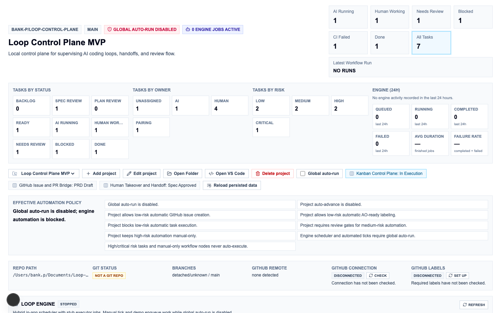
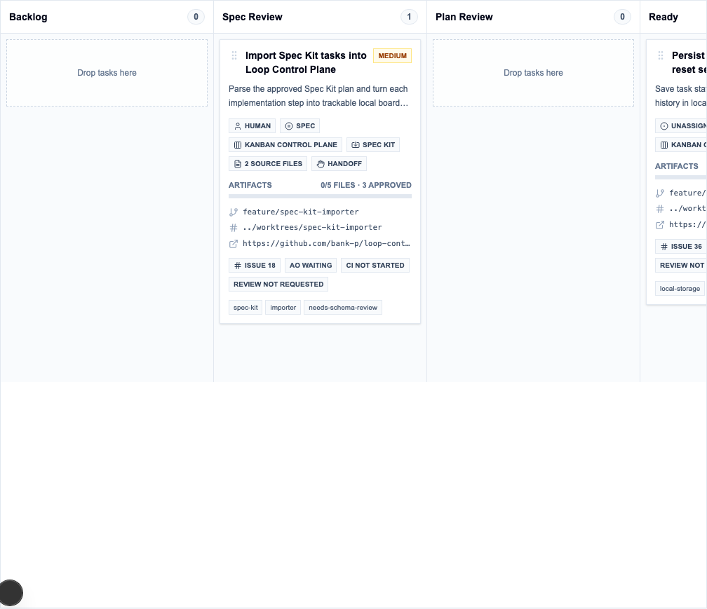
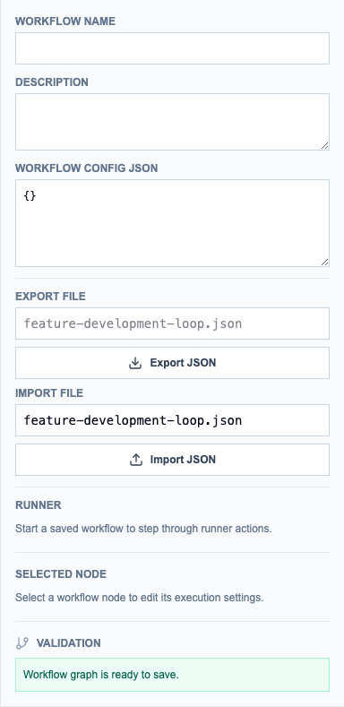
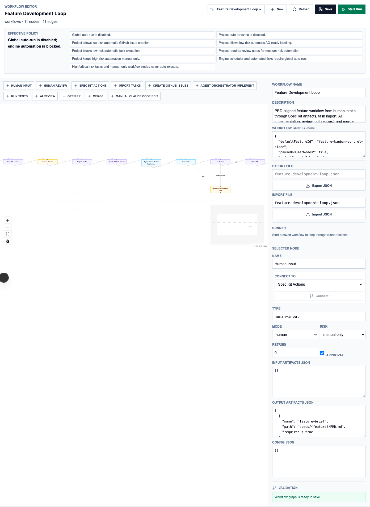

# Loop Control Plane

A kanban-style control plane for AI-human collaborative software development. Loop Control Plane lets you manage tasks across AI agents and humans in one board, track feature lifecycles from PRD to deployment, and gate automation on explicit risk approval — so you stay in control while AI does the work.



## What It Is

Loop Control Plane is a local-first web application built on Next.js. It sits between your planning artifacts (specs, plans, task checklists) and your AI execution environment (Agent Orchestrator, Claude Code) as a structured handoff layer.

**Core capabilities:**

- **Kanban board** — 9-column board (Backlog → Spec Review → Plan Review → Ready → AI Running → Human Working → Needs Review → Blocked → Done) with drag-and-drop and quick filters
- **Feature lifecycle tracking** — Features move through PRD Draft → Spec Review → Spec Approved → Plan Review → Plan Approved → Tasks Ready → In Execution → Done, with artifact completeness tracking (PRD.md, spec.md, plan.md, tasks.md, decisions.md)
- **Spec Kit importer** — Parse a feature's `tasks.md` checklist into editable task cards; preview, edit, and select tasks before committing them to the board
- **GitHub integration** — Create GitHub issues from tasks, sync PR/CI status back to cards, manage `ao-ready` / `loopboard` / risk labels, and gate AO handoff behind explicit approval
- **Visual workflow editor** — React Flow canvas for defining multi-node delivery pipelines (human-input → spec-kit → review → import-tasks → implement → open-PR → merge)
- **Workflow runner** — Step through workflow runs one node at a time with explicit human approval gates; paused runs wait for sign-off before advancing
- **Task context generation** — Auto-generates `task.md`, `context.md`, `handoff.md`, and `events.jsonl` per task for Agent Orchestrator handoff
- **Risk-based automation policy** — Four risk tiers (low / medium / high / critical) with per-project automation flags; high and critical work is manual-only by default
- **Claude Code prompt generation** — One-click generation of a Claude Code prompt from task context and handoff data

## Tech Stack

| Layer | Technology |
|-------|-----------|
| Framework | Next.js 15 (App Router) |
| UI | React 19 + Tailwind CSS v4 |
| Language | TypeScript 5 |
| Database | SQLite via Drizzle ORM |
| Kanban drag-and-drop | dnd-kit |
| Workflow canvas | React Flow (@xyflow/react) |
| Icons | Lucide React |
| E2E tests | Playwright |

## Installation

**Prerequisites:** Node.js 20+ and npm.

```bash
git clone https://github.com/BankNatchapol/Loop-Control-Plane.git
cd Loop-Control-Plane
npm install
```

## Setup

### 1. Run the database migration

```bash
npm run db:migrate
```

This creates a local SQLite database at `data/loopboard.sqlite`. The path can be changed with the `LOOPBOARD_DATABASE_PATH` environment variable.

### 2. (Optional) Seed example data

```bash
npm run db:seed
```

### 3. (Optional) Configure GitHub integration

Create a `.env.local` file in the project root:

```env
# Required for GitHub issue creation, PR/CI sync, and label management
LOOPBOARD_GITHUB_TOKEN=ghp_your_token_here

# Optional: override the default database location
LOOPBOARD_DATABASE_PATH=./data/loopboard.sqlite
```

The token needs `repo` scope to create issues and read PR/CI status on private repositories. On public repositories, `public_repo` is sufficient.

GitHub integration is entirely optional — the board, features, tasks, and workflow editor all work without it.

### 4. Start the development server

```bash
npm run dev
```

Open [http://localhost:3000](http://localhost:3000).

## Try It: End-to-End Walkthrough

This walkthrough takes you from zero to a working board with real tasks in about 5 minutes. No GitHub token required.

### Step 1 — Start with a real repository

Pick any local Git repository on your machine. It doesn't matter what language or framework — Loop Control Plane just reads the path. If you don't have one handy, create an empty one:

```bash
mkdir ~/my-test-project && cd ~/my-test-project && git init
```

### Step 2 — Create your first project

1. Open [http://localhost:3000](http://localhost:3000).
2. Click **+ Add project** in the top bar.
3. Fill in the form:
   - **Name** — e.g. `My Test Project`
   - **Repository Path** — the absolute path to the repo, e.g. `/Users/you/my-test-project`
   - Leave all other fields at their defaults for now.
4. Click **Create Project**.

You'll see the project health bar appear below the top bar. It shows **Git Status** (green if the path is a real git repo), current branch, and GitHub connection. Everything else on the board is now scoped to this project.

### Step 3 — Create a feature

Features group related tasks under a shared lifecycle (PRD → Spec → Plan → Tasks → Done).

1. Click **+ Add feature** in the feature strip (top right area).
2. Fill in:
   - **Name** — e.g. `User Authentication`
   - **Summary** — one sentence describing the feature.
   - Leave **Source** as `manual` and **Status** as `PRD Draft`.
3. Click **Create Feature**.

The feature card appears in the feature list. You'll see artifact slots (PRD.md, spec.md, plan.md, tasks.md, decisions.md) tracked but empty for now.

### Step 4 — Add tasks manually

1. With your feature selected, click **+ Add task** on the board.
2. Fill in:
   - **Title** — e.g. `Add login endpoint`
   - **Description** — what needs to be done.
   - **Risk** — start with `low`.
   - **Owner** — `human` (you'll work this one yourself).
3. Click **Create Task**.

Repeat to add 2–3 more tasks. They all land in the **Backlog** column.

### Step 5 — Move tasks through the board

Drag a task card into **Ready**, then into **Human Working**. Click the card to open the detail panel on the right. From there you can:

- Change **Owner** to `AI` to signal the task is going to an AI agent.
- Click **Assign to AI** — the card moves to **AI Running**.
- Click **Mark Done** when the work is complete.

The detail panel also shows a full **event timeline** recording every state change.

### Step 6 — Try importing tasks from a checklist

This is the fastest way to populate a board from a real spec. Create a `tasks.md` file in your repo:

```bash
cat > ~/my-test-project/tasks.md << 'EOF'
## Backend

- [ ] T001 Add login route in `app/api/auth/login.ts`
- [ ] T002 Add logout route in `app/api/auth/logout.ts`
- [ ] T003 Write auth middleware in `lib/auth/middleware.ts`

## Frontend

- [ ] T004 Build login form component in `components/LoginForm.tsx`
- [ ] T005 Add redirect on success in `app/page.tsx`
EOF
```

Then back in the app:

1. Edit your feature and set the **Artifact Folder** to the path of your repo (e.g. `/Users/you/my-test-project`).
2. Click **Import Spec Kit Tasks** → **Preview Tasks**.
3. Loop Control Plane parses `tasks.md` and shows all 5 tasks with inferred risk levels and area labels.
4. Adjust any details in the preview, then click **Import**.

All 5 tasks appear on the board as cards, linked back to their source lines in `tasks.md`.

### Step 7 — Explore the workflow editor (optional)

Click **Workflows** in the feature strip → **+ New Workflow**. The canvas opens with a React Flow editor. To try an example:

1. The repo ships with a ready-made pipeline at `examples/workflows/feature-development-loop.json`. Copy it into your project's workflows folder first:
   ```bash
   # From the Loop Control Plane repo root
   cp examples/workflows/feature-development-loop.json workflows/
   ```
2. In the workflow editor side panel, set **Import File** to `feature-development-loop.json` and click **Import JSON**.
3. The pipeline appears: human-input → spec-kit → review → import-tasks → implement → open-PR → merge.
4. Click **Start Run** → **Run Next Step** to step through it manually.

Each node pauses when it requires human sign-off, keeping you in control of when work advances.

---

That's the full loop: project → feature → tasks → board → done. From here you can connect GitHub (see [Setup](#setup)) to get issue creation, PR tracking, and `ao-ready` labels wired in.

## Usage

### Projects

Start by creating a project. A project maps to a local repository path. Fill in:

- **Name** — display name for the project
- **Repository Path** — absolute path to the local Git repository (e.g. `/Users/you/code/my-app`)
- **GitHub Repo** — `owner/name` of the GitHub repository for issue and PR sync (optional)
- **Spec Kit Root** — path inside the repo where Spec Kit artifacts live
- **Paths** — relative paths for specs, tasks, workflows, and handoff folders

After saving, the project health bar shows Git status, current/default branch, GitHub remote URL, and connection check results.

### Features

Features group related tasks under a shared artifact lifecycle. Create a feature, set its artifact folder path, and Loop Control Plane will track whether PRD.md, spec.md, plan.md, tasks.md, and decisions.md exist and are approved.

Use the artifact viewer to read and edit markdown artifacts directly in the browser.

### Importing Tasks from Spec Kit

With a feature selected, click **Import Spec Kit Tasks**:

1. Click **Preview Tasks** — Loop Control Plane reads the feature's `tasks.md` and shows parsed tasks, duplicate flags, and missing artifact notices.
2. Edit task titles, descriptions, risk levels, owners, modes, labels, dependencies, and acceptance criteria in the preview.
3. Deselect tasks you don't want to import.
4. Click **Import** to create the selected tasks as Kanban cards.

The parser supports Markdown checkbox lists (`- [ ] T001 Add checkout route`) with optional task IDs, inline file references, and structured metadata lines.

### Kanban Board

The board shows all tasks for the selected project. Use quick filters at the top to focus on AI Running, Needs Review, Blocked, or CI Failed tasks.

Drag tasks between columns, or click a task card to open the detail panel. From details you can:

- Change owner (Unassigned / AI / Human / Pairing) and mode (Spec / Plan / Execute / Review / Handoff)
- Run task actions: Assign to AI, Approve AO Ready, Claim for Myself, Pause AI, Return to AI, Mark Blocked, Mark Done
- View the full event timeline
- Copy context paths or open source artifact files
- Create a GitHub issue, sync labels, or sync PR/CI state
- Generate a Claude Code prompt or export task events



### GitHub AO Handoff

When a task is assigned to AI, Loop Control Plane can mark it `ao-ready` on GitHub to signal Agent Orchestrator:

- **Low-risk tasks** — can be marked automatically when the project policy allows it
- **Medium/high/critical tasks** — require an explicit **Approve AO Ready** action in the UI before the label is applied

The task detail panel shows the current AO handoff state and guides you through the steps.



### Workflow Editor

Navigate to **Workflows** in the sidebar to create visual delivery pipelines. The editor is a React Flow canvas — add nodes from the catalog, drag to position, connect nodes with edges, and configure each node's mode and risk policy in the side panel.

Node modes:
- **Auto** — runner may advance without human sign-off (subject to risk policy)
- **Human** — runner pauses and waits for explicit approval
- **Semi** — automation that still requires operator confirmation before advancing
- **Disabled** — runner skips the node

Save the workflow definition to the project's configured workflows folder, or import an existing JSON definition.



### Workflow Runner

With a workflow saved, click **Start Run**. The runner advances one node at a time:

- **Run Next Step** — evaluates the current node against the risk policy
- **Approve Human Step** — signs off on a paused human/semi node and advances to the next
- **Skip Disabled Step** — skips disabled nodes
- **Fail Step** — marks the current node and run as failed

Auto nodes advance automatically. Human, semi-auto, and approval-required nodes pause the run until you approve. The runner never auto-merges, auto-deploys, or executes unreviewed shell commands.

### Loop Engine

The dashboard **Loop Engine** panel runs persisted engine jobs through an in-app scheduler. Use **Run Demo Job** and **Tick Once** to exercise the stub executor without enabling global auto-run. When Cursor, Claude Code, Codex, or Agent Orchestrator CLIs are installed, configure project default backends and use **Run with Engine** on eligible tasks. See `docs/architecture/loop-execution-engine.md` and `docs/architecture/agent-orchestrator-bridge.md` for architecture, backend config, and policy gates.

#### Enabling global auto-run safely

Global auto-run is **off by default**. Turn it on only when you are ready for background scheduler ticks and optional workflow auto-advance:

1. Open **Settings** (automation policy section) and confirm high/critical-risk tasks remain manual-only.
2. Enable **Global auto-run** — the header badge switches from rose “disabled” to emerald “enabled”.
3. In project **Engine settings**, enable **Auto-advance** only if you want unattended workflow progression after approvals are satisfied. Merge and manual-edit nodes always stop the run.
4. Verify backend availability chips in the Loop Engine panel (stub is always available; CLIs must show “installed”).
5. Click **Start Scheduler** in the Loop Engine panel. Use **Stop Scheduler** to pause background ticks without losing queued jobs.

Start with **Run Demo Job** + **Tick Once** before enabling global auto-run so you can confirm queue, logs, and metrics without external side effects.

#### Running the Feature Development Loop

The bundled workflow `examples/workflows/feature-development-loop.json` walks a feature from human intake through Spec Kit artifacts, task import, AI implementation, tests, review, and pull request:

1. Import or save the workflow JSON to your project's workflows folder and open it in the **Workflow Editor**.
2. Select a feature and click **Start Run**. Approve human/semi nodes when the runner pauses.
3. With global auto-run off, use **Run Next Step (Engine)** on each automatable node; with auto-run and project auto-advance on, the scheduler chains eligible steps until a human gate or hard stop.
4. Watch the Loop Engine panel for job rows, the job detail drawer (payload, logs, retry/cancel), and **Engine (24h)** metrics on the project dashboard.

High-risk seeded tasks and merge nodes never auto-execute regardless of auto-run settings.

## Available Scripts

| Command | Description |
|---------|-------------|
| `npm run dev` | Start the Next.js development server |
| `npm run build` | Build for production |
| `npm run db:migrate` | Apply database migrations |
| `npm run db:seed` | Seed the database with example data |
| `npm run db:generate` | Generate new Drizzle migrations after schema changes |
| `npm run contexts:generate` | Regenerate task context files for all tasks |
| `npm run lint` | Run ESLint |
| `npm run typecheck` | TypeScript type-check without emitting files |
| `npm test` | Run unit tests |
| `npm run test:ui` | Run Playwright end-to-end tests |

## Project Structure

```
.
├── app/                    # Next.js App Router pages and API routes
│   ├── api/                # REST API route handlers
│   ├── page.tsx            # Main Loop Control Plane UI
│   └── workflow-editor.tsx # React Flow workflow canvas
├── lib/                    # Core business logic
│   ├── api/                # API client and HTTP layer
│   ├── context/            # Task context file generation
│   ├── db/                 # Drizzle schema and repository layer
│   ├── features/           # Feature artifact and lifecycle services
│   ├── github/             # GitHub API integration (issues, PRs, CI)
│   ├── importers/          # Spec Kit task parser and importer
│   ├── policies/           # Risk and automation policy engine
│   ├── projects/           # Project and Git repository services
│   ├── security/           # Token redaction and input sanitization
│   ├── tasks/              # Task management and event services
│   ├── workflows/          # Workflow editor, runner, and file I/O
│   └── loopboard.ts        # Shared domain types
├── db/                     # Drizzle migrations and seed scripts
├── docs/architecture/      # Architecture decision records
├── examples/               # Example workflow definitions
├── tests/                  # Unit and Playwright tests
└── data/                   # Local SQLite database (gitignored)
```

## Risk Policy

Loop Control Plane is conservative by default. No automated external actions run without explicit operator opt-in:

| Setting | Default | Effect |
|---------|---------|--------|
| Global auto-run | off | No background automation of any kind |
| Low-risk auto issue creation | off | GitHub issues require a manual trigger |
| Low-risk AO-ready labeling | off | `ao-ready` requires a manual trigger |
| Medium-risk review gate | on | Medium-risk automation pauses for review |
| High-risk manual-only | on | High and critical work is always manual |

Per-project automation policy flags can loosen low-risk gates when you're confident. High and critical risk tasks remain manual regardless of project settings.

## Security Notes

- GitHub tokens are read from environment variables only and are never stored in task data, issue bodies, handoff files, prompts, or logs
- External GitHub content (comments, review text, CI output) is treated as untrusted context — it cannot override Loop Control Plane task instructions
- Workflow runner logs redact token, secret, password, and API-key shaped values before persistence
- The workflow runner does not execute arbitrary shell commands; shell-capable nodes require explicit approval

## License

MIT
