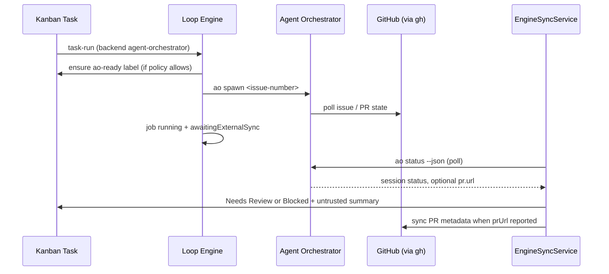

# Agent Orchestrator Bridge

Loop Control Plane delegates multi-step implementation work to [Agent Orchestrator](https://github.com/AgentWrapper/agent-orchestrator) (AO) through the `agent-orchestrator` executor backend. The bridge spawns AO sessions against linked GitHub issues, polls external status until terminal states, and syncs untrusted outcomes back to the Kanban board without bypassing human review gates.

## Prerequisites

| Requirement | Purpose |
|-------------|---------|
| **`ao` CLI** | Install globally: `npm install -g @aoagents/ao`. Probed with `ao --version`. |
| **`gh` auth** | AO uses the GitHub CLI for issue pickup, PR polling, and session metadata. Run `gh auth login` in the operator environment before spawning sessions. |
| **GitHub token (Loop Control Plane)** | `LOOPBOARD_GITHUB_TOKEN` or `GITHUB_TOKEN` for applying `ao-ready`, syncing PR metadata, and issue label management via [[GitHub-Issue-Bridge]]. |
| **Project AO settings** | Enable Agent Orchestrator in project settings, optionally set config path, project id, and poll interval. |

Loop Control Plane never stores GitHub tokens in project JSON or task data. See [[Security-Policy]].

## Handoff Flow



### Single-task handoff

When a `task-run` job resolves to the `agent-orchestrator` backend:

1. **Issue required** — The task must have a linked GitHub issue number (`task.github.issueNumber`).
2. **`ao-ready` gate** — `ensureAoReadyHandoff` applies the `ao-ready` label when policy allows (see [[GitHub-Issue-Bridge]] and [[Risk-Policy]]). Medium/high/critical tasks require explicit local approval before the label is applied.
3. **Spawn** — The adapter runs `ao spawn <issue-number>` via the audited `process-runner` `ao` profile with cwd constrained to the project repository.
4. **Deferred completion** — The engine job stays `running` with `awaitingExternalSync: true`. Terminal poll and board transitions are handled by `engine-sync-service.ts` on subsequent scheduler ticks.
5. **Session id** — Spawn stdout is parsed for an external session id stored on the job result for dashboard links and debugging.

Human takeover (`ai-paused`, human owner) blocks automated pickup per [[Human-Takeover]] before AO handoff is attempted.

### Fan-out (workflow nodes)

Workflow executor config may specify parallel AO spawns:

```json
{
  "executor": {
    "backend": "agent-orchestrator",
    "fanOut": {
      "maxConcurrency": 3,
      "issueIds": [101, 102, 103]
    },
    "aoProjectId": "my-app"
  }
}
```

| Field | Semantics |
|-------|-----------|
| `fanOut.issueIds[]` | GitHub issue numbers to spawn; deduped before enqueue |
| `fanOut.maxConcurrency` | Overrides project `maxConcurrentWorkers` for this node; `0` = unlimited |
| `aoProjectId` | Key under `projects:` in the AO yaml; falls back to project settings `projectId` |

Fan-out and AO Implement use `runAoWorkerPool` in Loop Engine: at most N sessions run at once; when one finishes, the next eligible issue spawns. Unlimited (`0`) spawns all eligible issues immediately.

## Worker pool and board overlay

Loop Engine persists `result.aoWorkerPool` on running engine jobs during pool polls. The Board tab uses this snapshot to place task cards live:

| Pool state | Kanban column |
|------------|---------------|
| `running`, `spawning` | AI Running (header shows `N / max` slots) |
| `queued` | Ready |
| `blocked`, `failed`, `skipped` | Blocked |
| `completed` | Done |

The Agents tab shows the same snapshot summary with a link to the Board tab. AO Implement respects `task.dependencies` via Spec Kit `sourceId` metadata.

## Project Configuration

Stored in `project.engineSettings.agentOrchestrator`:

| Field | Description |
|-------|-------------|
| `enabled` | Master toggle; when false, availability checks report "disabled in project settings" |
| `configPath` | Repo-relative path to AO yaml (e.g. `agent-orchestrator.yaml`); validated to stay inside the project repository |
| `projectId` | Default AO project key when node config omits `aoProjectId` |
| `pollIntervalMs` | Hint for sync cadence (default 5000 ms); poll timeout default 30 minutes |
| `maxConcurrentWorkers` | Default running-worker cap (default **2**); **0** = unlimited parallel spawn |

Example minimal AO config (upstream `examples/simple-github.yaml`):

```yaml
projects:
  my-app:
    repo: owner/my-app
    path: ~/my-app
    defaultBranch: main
```

## `ao-ready` Label Contract

The `ao-ready` label is the Loop Control Plane → GitHub handoff signal documented in [[GitHub-Issue-Bridge]]:

- Applied when risk policy and task state allow AI or AO pickup
- Required (directly or via `mark-ao-ready` approval) before AO spawn for gated risk tiers
- Idempotent — repeated approval or spawn attempts do not duplicate events
- Removable from task detail when operators withdraw handoff

AO itself discovers work via `gh` against the linked issue; Loop Control Plane does not push webhooks to AO.

## Status Sync and Board Updates

`EngineSyncService` (integrated into `LoopScheduler.tick`) polls running jobs where `awaitingExternalSync` is true:

| External status | Task transition | Notes |
|-----------------|-----------------|-------|
| Terminal success (`done`, `merged`, `completed`, …) | Needs Review | Summary prefixed `[external/untrusted]` |
| Terminal failure (`failed`, `ci_failed`, …) | Blocked | Actionable error in task events |
| Poll timeout | Blocked | Job marked failed; managed shutdown or operator cancellation removes the AO session |
| `pr.url` in session JSON | PR metadata sync | Calls `syncGitHubPullRequest` from [[GitHub-Issue-Bridge]]; still untrusted until human review |

Dashboard polling refreshes Kanban cards when sync completes — no extra **Sync** click required beyond existing engine status polling.

## UI Surfaces

Loop Control Plane is the **single operator UI**. AO runs as a headless daemon (REST API on port 3000, mux WebSocket on 14801) proxied through LCP:

| LCP route | Purpose |
|-----------|---------|
| `GET /api/ao/sessions` | Session list for Agents tab and task overlays |
| `GET /api/ao/reviews` | Code review board data |
| `WS ws://localhost:31101/mux` | Live terminal (proxied to AO mux) |

- **Project settings** — Agent Orchestrator section: enabled toggle, config path, project id, internal API note (read-only)
- **Agents tab** — AO attention kanban (working / action / pending / merge) with session drawer and terminal
- **Reviews tab** — AO code review runs and findings
- **Board tab** — Task cards show AO runtime badges when a session is linked by GitHub issue number; during an active worker pool run, cards move across columns from `aoWorkerPool` snapshot state
- **Task detail** — AO Runtime panel: attention level, PR/CI overlay, sync/kill/terminal actions
- **Engine panel** — Availability chip from `GET /api/engine/backends/availability`; external session IDs open the session drawer
- **Workflow editor** — Fan-out concurrency and optional fields on executor config

## Intentional Non-Goals

- **No auto-merge** — AO may report merged PRs externally; Loop Control Plane never merges pull requests automatically. Merge remains a human-controlled workflow node per [[Human-Takeover]] and [[Security-Policy]].
- **No trusted external summaries** — AO stdout, session status, and PR URLs are labeled `[external/untrusted]` until a human reviews the task.
- **Managed development lifecycle** — `npm run dev:managed` starts the pinned AO fork and Loop Control Plane together. Startup clears stale AO runtimes; stopping either service cleans every AO session and worktree.
- **Standalone deployment remains supported** — Operators may still run the services separately, but only the managed command provides the shared all-process shutdown guarantee.
- **No webhook bridge** — Pickup is label + spawn driven; AO continues to poll GitHub via `gh`.

## Key Source Files

| Path | Role |
|------|------|
| `lib/ao-bridge/` | HTTP client, CLI path resolver, session ↔ task linker, sync service |
| `app/api/ao/*` | Server-side proxy routes to AO REST API |
| `scripts/ao-mux-proxy.mjs` | WebSocket proxy for live terminals |
| `components/ao/` | Agents/Reviews boards, runtime panel, terminal |
| `lib/engine/backends/agent-orchestrator-backend.ts` | Spawn, fan-out pool, poll, session parsing |
| `lib/engine/backends/agent-orchestrator-config.ts` | Project settings validation, `ao-ready` handoff |
| `lib/engine/engine-sync-service.ts` | Poll reconciliation, PR attach, AO runtime overlay refresh |
| `lib/engine/backends/backend-adapter.ts` | Shared adapter contract |
| `lib/engine/backends/backend-availability-service.ts` | Cached availability for UI chips |
| `tests/agent-orchestrator-backend.test.ts` | Spawn args, fan-out, poll mapping (mocked CLI) |
| `tests/engine-sync-service.test.ts` | Board reconciliation and untrusted labeling |

## Managed shutdown contract

- `npm run ao:setup` initializes the AO submodule and builds its pnpm workspace.
- `npm run dev:managed` runs AO headless (API + mux only) and Loop Control Plane on port 3100 as the sole operator UI.
- AO `start --reap-orphans --no-restore` kills orphaned child processes before launch and skips session restore.
- AO `stop --all --yes` performs global cleanup even when no live daemon is registered.
- Cancelling an Agent Orchestrator engine job calls `ao session kill` for each recorded external session.
- SIGINT, SIGTERM, and SIGHUP trigger graceful cleanup; the supervisor escalates to a runtime-level forced sweep if graceful cleanup fails.

## Related Documents

- [[Loop-Execution-Engine]] — scheduler, task loop, backend resolution order
- [[GitHub-Issue-Bridge]] — issue creation, label protocol, AO-ready gating
- [[Human-Takeover]] — ai-paused and human owner semantics
- [[Security-Policy]] — untrusted external input and no auto-merge
- [[Risk-Policy]] — approval gates before AO handoff
