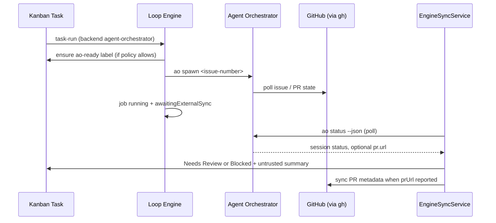

# Agent Orchestrator Bridge

Loop Control Plane delegates multi-step implementation work to [Agent Orchestrator](https://github.com/AgentWrapper/agent-orchestrator) (AO) through the `agent-orchestrator` executor backend. The bridge spawns AO sessions against linked GitHub issues, polls external status until terminal states, and syncs untrusted outcomes back to the Kanban board without bypassing human review gates.

## Prerequisites

| Requirement | Purpose |
|-------------|---------|
| **`ao` CLI** | Install globally: `npm install -g @aoagents/ao`. Probed with `ao --version`. |
| **`gh` auth** | AO uses the GitHub CLI for issue pickup, PR polling, and session metadata. Run `gh auth login` in the operator environment before spawning sessions. |
| **GitHub token (Loop Control Plane)** | `LOOPBOARD_GITHUB_TOKEN` or `GITHUB_TOKEN` for applying `ao-ready`, syncing PR metadata, and issue label management via [[GitHub-Issue-Bridge]]. |
| **Project AO settings** | Enable Agent Orchestrator in project settings, optionally set config path, project id, dashboard URL, and poll interval. |

Loop Control Plane never stores GitHub tokens in project JSON or task data. See [[Security-Policy]].

## Handoff Flow



### Single-task handoff

When a `task-run` job resolves to the `agent-orchestrator` backend:

1. **Issue required** — The task must have a linked GitHub issue number (`task.github.issueNumber`).
2. **`ao-ready` gate** — `ensureAoReadyHandoff` applies the `ao-ready` label when policy allows (see [[GitHub-Issue-Bridge]] and [[Risk-Policy]]). Medium/high/critical tasks require explicit local approval before the label is applied.
3. **Spawn** — The adapter runs `ao spawn <issue-number>` via the audited `process-runner` `ao` profile with cwd constrained to the project repository.
4. **Deferred completion** — The engine job stays `running` with `awaitingExternalSync: true`. Terminal poll and board transitions are handled by `engine-sync-service.ts` on subsequent scheduler ticks.
5. **Session id** — Spawn stdout is parsed for an external session id stored on the job result for dashboard links and debugging.

Human takeover (`ai-paused`, human owner) blocks automated pickup per [[Human-Takeover]] before AO handoff is attempted.

### Fan-out (workflow nodes)

Workflow executor config may specify parallel AO spawns:

```json
{
  "executor": {
    "backend": "agent-orchestrator",
    "fanOut": {
      "maxConcurrency": 3,
      "issueIds": [101, 102, 103]
    },
    "aoProjectId": "my-app"
  }
}
```

| Field | Semantics |
|-------|-----------|
| `fanOut.issueIds[]` | GitHub issue numbers to spawn; deduped before enqueue |
| `fanOut.maxConcurrency` | Upper bound on parallel `ao spawn` calls (default pool size 1 when omitted) |
| `aoProjectId` | Key under `projects:` in the AO yaml; falls back to project settings `projectId` |

Fan-out is intended for workflow-step jobs with multiple ready delivery tasks. Each spawn is independent; completion mapping uses session status from `ao status --json`.

## Project Configuration

Stored in `project.engineSettings.agentOrchestrator`:

| Field | Description |
|-------|-------------|
| `enabled` | Master toggle; when false, availability checks report "disabled in project settings" |
| `configPath` | Repo-relative path to AO yaml (e.g. `agent-orchestrator.yaml`); validated to stay inside the project repository |
| `projectId` | Default AO project key when node config omits `aoProjectId` |
| `dashboardUrl` | Base URL for **Open AO Dashboard** link on task detail (e.g. `http://localhost:3000`) |
| `pollIntervalMs` | Hint for sync cadence (default 5000 ms); poll timeout default 30 minutes |

Example minimal AO config (upstream `examples/simple-github.yaml`):

```yaml
projects:
  my-app:
    repo: owner/my-app
    path: ~/my-app
    defaultBranch: main
```

## `ao-ready` Label Contract

The `ao-ready` label is the Loop Control Plane → GitHub handoff signal documented in [[GitHub-Issue-Bridge]]:

- Applied when risk policy and task state allow AI or AO pickup
- Required (directly or via `mark-ao-ready` approval) before AO spawn for gated risk tiers
- Idempotent — repeated approval or spawn attempts do not duplicate events
- Removable from task detail when operators withdraw handoff

AO itself discovers work via `gh` against the linked issue; Loop Control Plane does not push webhooks to AO.

## Status Sync and Board Updates

`EngineSyncService` (integrated into `LoopScheduler.tick`) polls running jobs where `awaitingExternalSync` is true:

| External status | Task transition | Notes |
|-----------------|-----------------|-------|
| Terminal success (`done`, `merged`, `completed`, …) | Needs Review | Summary prefixed `[external/untrusted]` |
| Terminal failure (`failed`, `ci_failed`, …) | Blocked | Actionable error in task events |
| Poll timeout | Blocked | Job marked failed; **AO session left running** (no kill by default) |
| `pr.url` in session JSON | PR metadata sync | Calls `syncGitHubPullRequest` from [[GitHub-Issue-Bridge]]; still untrusted until human review |

Dashboard polling refreshes Kanban cards when sync completes — no extra **Sync** click required beyond existing engine status polling.

## UI Surfaces

- **Project settings** — Agent Orchestrator section: enabled toggle, config path, project id, dashboard URL
- **Engine panel** — Availability chip (`ao: installed`, `ao: config missing`, etc.) from `GET /api/engine/backends/availability` (60s cache)
- **Workflow editor** — Fan-out concurrency and optional fields on executor config
- **Task detail** — **Open AO Dashboard** when `dashboardUrl` is configured

## Intentional Non-Goals

- **No auto-merge** — AO may report merged PRs externally; Loop Control Plane never merges pull requests automatically. Merge remains a human-controlled workflow node per [[Human-Takeover]] and [[Security-Policy]].
- **No trusted external summaries** — AO stdout, session status, and PR URLs are labeled `[external/untrusted]` until a human reviews the task.
- **No AO daemon management** — Loop Control Plane spawns sessions and polls status; it does not start or stop the AO dashboard process (`ao start`) on behalf of operators.
- **No webhook bridge** — Pickup is label + spawn driven; AO continues to poll GitHub via `gh`.

## Key Source Files

| Path | Role |
|------|------|
| `lib/engine/backends/agent-orchestrator-backend.ts` | Spawn, fan-out pool, poll, session parsing |
| `lib/engine/backends/agent-orchestrator-config.ts` | Project settings validation, `ao-ready` handoff |
| `lib/engine/engine-sync-service.ts` | Poll reconciliation, PR attach, timeout handling |
| `lib/engine/backends/backend-adapter.ts` | Shared adapter contract |
| `lib/engine/backends/backend-availability-service.ts` | Cached availability for UI chips |
| `tests/agent-orchestrator-backend.test.ts` | Spawn args, fan-out, poll mapping (mocked CLI) |
| `tests/engine-sync-service.test.ts` | Board reconciliation and untrusted labeling |

## Related Documents

- [[Loop-Execution-Engine]] — scheduler, task loop, backend resolution order
- [[GitHub-Issue-Bridge]] — issue creation, label protocol, AO-ready gating
- [[Human-Takeover]] — ai-paused and human owner semantics
- [[Security-Policy]] — untrusted external input and no auto-merge
- [[Risk-Policy]] — approval gates before AO handoff
