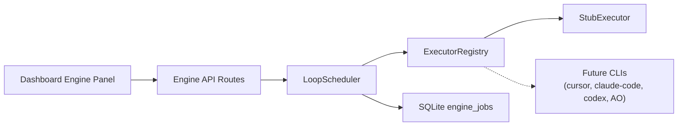

# Loop Execution Engine

Phase 01 adds a hybrid loop execution engine to Loop Control Plane. An in-app scheduler dequeues persisted jobs from SQLite, resolves a pluggable executor backend, and records redacted execution logs. Heavy work is delegated to executor implementations; today only the built-in `stub` backend runs. The workflow graph runner in [[Workflow-Editor-Runner]] remains the state machine for workflow nodes — the engine is the job queue and execution layer that will eventually back `workflow-step` and `task-run` work.

Automation gates from [[Risk-Policy]] and trusted-input boundaries from [[Security-Policy]] apply before any automated scheduler tick. Global auto-run stays off by default.

## Hybrid Architecture



| Layer | Responsibility |
|-------|----------------|
| **Dashboard panel** | Polls status, enqueues demo jobs, manual tick, start/stop scheduler |
| **API routes** | `GET /api/engine/status`, `POST /api/engine/{start,stop,tick,demo-job}` |
| **LoopScheduler** | Tick orchestration, policy checks, dequeue, finalize job state |
| **ExecutorRegistry** | Maps `(backend, jobKind)` to an `Executor` implementation |
| **SQLite** | `engine_jobs` queue + `engine_scheduler_state` singleton |
| **Background interval** | When scheduler is `running` and global auto-run is on, `POST /api/engine/start` starts process-memory ticks every 3s |

The scheduler is not a separate daemon. It runs inside the Next.js Node process and advances work only on explicit ticks (manual button, background interval, or test harness).

## Executor Backends

Backends are declared in `lib/engine/loop-engine-types.ts`:

| Backend | Phase 01 status | Purpose |
|---------|-----------------|---------|
| `stub` | **Implemented** | Deterministic completion for demo jobs and tests |
| `cursor` | Reserved | Future Cursor CLI / SDK adapter |
| `claude-code` | Reserved | Future Claude Code CLI adapter |
| `codex` | Reserved | Future Codex CLI adapter |
| `agent-orchestrator` | Reserved | Future Agent Orchestrator handoff |

Only `stub` is registered in `IMPLEMENTED_EXECUTOR_BACKENDS`. Requests for other backends return explainable errors (`executor_backend_unknown` or `executor_backend_disabled`) with human-readable reasons from `describeExecutorBackendAvailability`.

### ExecutorConfig on Nodes and Task Runs

Per-step backend settings live in existing JSON `config`, not a new column:

```json
{
  "executor": {
    "backend": "stub",
    "command": "optional-command",
    "workingDirectory": "/path/to/repo",
    "timeoutMs": 60000,
    "envAllowlist": ["NODE_ENV"]
  }
}
```

Helpers `readExecutorConfig`, `validateExecutorConfig`, and `withExecutorConfig` read and validate nested `config.executor`. Invalid config produces structured validation issues for the UI and API.

## Job Lifecycle

### Job kinds

| Kind | Phase 01 usage |
|------|----------------|
| `demo-ping` | Dashboard **Run Demo Job** — stub backend smoke test |
| `task-run` | Reserved — future task-scoped executor runs |
| `workflow-step` | Reserved — future bridge from workflow runner to engine |

### Job statuses

`queued` → `running` → `completed` | `failed` | `cancelled`

1. **Enqueue** — `createEngineJob` inserts a row with `status: queued`, `attempt: 1`, and initial execution logs.
2. **Tick plan** — `planNextTick` checks scheduler state, global automation policy (for automated ticks), and whether a queued job exists.
3. **Dequeue** — `fetchNextQueuedJob` returns the oldest eligible job (FIFO by `queued_at`).
4. **Execute** — Job marked `running`; registry resolves executor; `execute` returns stdout/stderr summaries and log entries.
5. **Finalize** — `processEngineJob` sets `completed` on success, or increments `attempt` and requeues when under `maxAttempts`, otherwise `failed` with redacted error text.

### Scheduler states

| State | Meaning |
|-------|---------|
| `stopped` | Default on boot; no automatic ticks |
| `running` | Accepts automated ticks when global auto-run is enabled |
| `paused` | Skips automated ticks until resumed |

Transitions: `start`, `stop`, `pause` via `applySchedulerTransition` and `LoopScheduler` service methods.

### Retry semantics

Failed executor results increment `attempt`. When `attempt < maxAttempts`, the job returns to `queued` with a retry log entry. Otherwise it stays `failed` with redacted error text in `error` and execution logs.

## Policy Gates

Engine behavior follows `lib/policies/automation-policy.ts`:

| Action | Global auto-run off | Global auto-run on |
|--------|---------------------|---------------------|
| **Run Demo Job** (`POST /api/engine/demo-job`) | Allowed | Allowed |
| **Tick Once** (`POST /api/engine/tick`, manual mode) | Allowed | Allowed |
| **Start Scheduler** (`POST /api/engine/start`) | **403** — policy deny | Allowed; starts background interval |
| **Automated tick** (background interval) | Skipped — policy deny | Allowed when scheduler is `running` |

`evaluateGlobalAutomationPolicy` returns `deny` with code `global_auto_run_disabled` when `globalAutoRunEnabled` is false. The dashboard **Start Scheduler** button is disabled and shows `describeEffectiveAutomationPolicy` reasons.

Manual ticks bypass the global policy gate so developers can exercise the engine without enabling background automation.

## Log Redaction

Engine logs pass through `redactEngineLogEntry` and `redactSensitiveText` (`lib/security/safe-context.ts`), matching patterns used by the workflow runner: tokens, secrets, passwords, bearer values, and api-key-shaped strings are replaced before persistence and API responses.

## Persistence

Migration `db/migrations/0008_loop_engine.sql` adds:

- **`engine_jobs`** — job queue with JSON `payload`, `result`, and `execution_logs`; optional FKs to projects, tasks, and workflow runs; indexes on `status`, `(status, queued_at)`, and project lookups.
- **`engine_scheduler_state`** — singleton row `id = 'default'`; initialized to `stopped` with `tick_count = 0`.

`LoopBoardRepository` exposes create/list/get/update job methods, `appendEngineLogEntry`, `fetchNextQueuedJob`, and scheduler read/update helpers. Seed data includes one completed historical `demo-ping` job for dashboard display; the scheduler is **not** auto-started on boot.

## API and Client Helpers

| Route | Method | Purpose |
|-------|--------|---------|
| `/api/engine/status` | GET | Scheduler state, queue counts by status, latest 10 jobs (redacted summaries), automation policy |
| `/api/engine/start` | POST | Start scheduler + background ticks (requires global auto-run) |
| `/api/engine/stop` | POST | Stop scheduler + clear background interval |
| `/api/engine/tick` | POST | Single tick; body `{ mode?: "manual" \| "automated" }` |
| `/api/engine/demo-job` | POST | Enqueue stub `demo-ping` for `{ projectId }` |

Typed client helpers in `lib/api/loopboard-client.ts`: `fetchEngineStatus`, `startEngineScheduler`, `stopEngineScheduler`, `tickEngine`, `enqueueEngineDemoJob`.

## Dashboard Engine Panel

The **Loop Engine** panel on the project dashboard (`app/page.tsx`) shows:

- Scheduler status badge (`stopped` / `running` / `paused`)
- Queue depth and last tick time
- Active backend from the most recent job
- Recent job rows with status badges and last log message

Controls: **Run Demo Job**, **Tick Once**, **Start Scheduler**, **Stop Scheduler**. Status polls every 3 seconds while the dashboard is open.

## Key Source Files

| Path | Role |
|------|------|
| `lib/engine/loop-engine-types.ts` | Domain types, executor config validation |
| `lib/engine/executor-registry.ts` | `Executor` interface, `StubExecutor`, registry |
| `lib/engine/loop-scheduler.ts` | Tick orchestration, pure test helpers |
| `lib/engine/scheduler-interval.ts` | Process-memory background tick interval |
| `lib/api/engine-actions.ts` | Status aggregation and route action handlers |
| `app/api/engine/**` | HTTP route handlers |
| `tests/loop-engine-*.test.ts` | Types, scheduler, repository, API coverage |

## Intentional Non-Goals (Phase 01)

Phase 01 is a **foundation skeleton**, not full autonomous loop execution:

- **No real CLI invocation** — Cursor, Claude Code, Codex, and Agent Orchestrator backends are typed and validated but not implemented.
- **No workflow runner integration** — `workflow-step` jobs are not enqueued from the graph runner yet.
- **No task-run automation** — Task cards do not auto-spawn engine jobs.
- **No global auto-run by default** — Operators must explicitly enable automation before the scheduler runs unattended.
- **No distributed queue** — Single-process SQLite queue; no Redis, no multi-instance coordination.

Future phases will register real executors following the narrow adapter pattern from `lib/system/local-command-runner.ts`, wire workflow nodes to `workflow-step` jobs, and connect task context handoff artifacts to `task-run` execution.

## Related Documents

- [[Workflow-Editor-Runner]] — graph runner that remains separate from engine job execution
- [[Risk-Policy]] — global auto-run defaults and risk gates
- [[Security-Policy]] — token handling and trusted-input rules
- [[loop-engine-execution-boundaries]] — Phase 01 inspection notes on reuse boundaries
