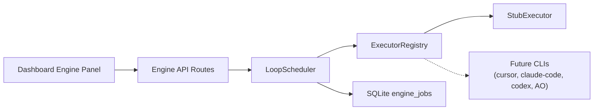
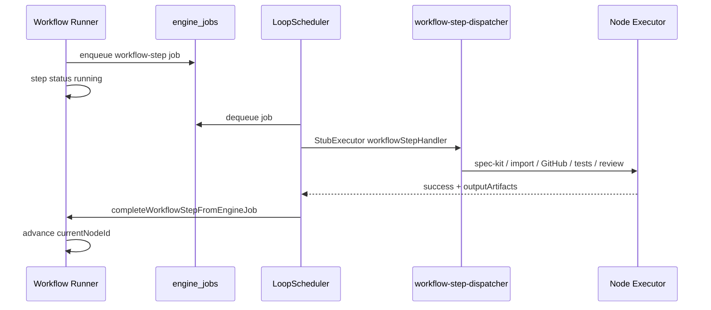
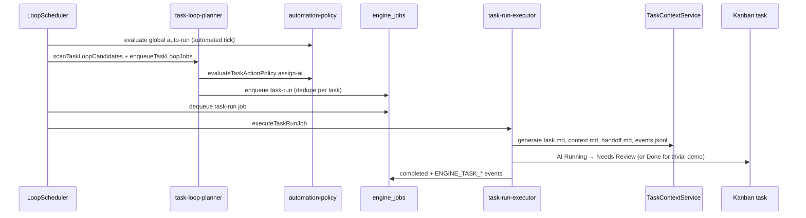

# Loop Execution Engine

Phase 01 adds a hybrid loop execution engine to Loop Control Plane. An in-app scheduler dequeues persisted jobs from SQLite, resolves a pluggable executor backend, and records redacted execution logs. Heavy work is delegated to executor implementations. Phase 03 wires the workflow graph runner in [[Workflow-Editor-Runner]] to enqueue `workflow-step` jobs that invoke real node executors (Spec Kit CLI, task import, GitHub delivery, test runs, AI review stubs) through the engine queue.

Automation gates from [[Risk-Policy]] and trusted-input boundaries from [[Security-Policy]] apply before any automated scheduler tick. Global auto-run stays off by default.

## Hybrid Architecture



| Layer | Responsibility |
|-------|----------------|
| **Dashboard panel** | Polls status, enqueues demo jobs, manual tick, start/stop scheduler |
| **API routes** | `GET /api/engine/status`, `POST /api/engine/{start,stop,tick,demo-job}` |
| **LoopScheduler** | Tick orchestration, policy checks, dequeue, finalize job state |
| **ExecutorRegistry** | Maps `(backend, jobKind)` to an `Executor` implementation |
| **SQLite** | `engine_jobs` queue + `engine_scheduler_state` singleton |
| **Background interval** | When scheduler is `running` and global auto-run is on, `POST /api/engine/start` starts process-memory ticks every 3s |

The scheduler is not a separate daemon. It runs inside the Next.js Node process and advances work only on explicit ticks (manual button, background interval, or test harness).

## Executor Backends

Backends are declared in `lib/engine/loop-engine-types.ts`:

| Backend | Phase 01 status | Phase 03 usage |
|---------|-----------------|----------------|
| `stub` | **Implemented** | Default backend for demo jobs, workflow-step dispatch, and deterministic test doubles |
| `cursor` | Reserved | Future Cursor CLI / SDK adapter |
| `claude-code` | Reserved | Future Claude Code CLI adapter |
| `codex` | Reserved | Future Codex CLI adapter |
| `agent-orchestrator` | Reserved | Future Agent Orchestrator handoff |

Only `stub` is registered in `IMPLEMENTED_EXECUTOR_BACKENDS`. Requests for other backends return explainable errors (`executor_backend_unknown` or `executor_backend_disabled`) with human-readable reasons from `describeExecutorBackendAvailability`.

### ExecutorConfig on Nodes and Task Runs

Per-step backend settings live in existing JSON `config`, not a new column:

```json
{
  "executor": {
    "backend": "stub",
    "command": "optional-command",
    "workingDirectory": "/path/to/repo",
    "timeoutMs": 60000,
    "envAllowlist": ["NODE_ENV"]
  }
}
```

Helpers `readExecutorConfig`, `validateExecutorConfig`, and `withExecutorConfig` read and validate nested `config.executor`. Invalid config produces structured validation issues for the UI and API.

## Job Lifecycle

### Job kinds

| Kind | Usage |
|------|-------|
| `demo-ping` | Dashboard **Run Demo Job** — stub backend smoke test |
| `task-run` | **Implemented (Phase 02)** — task-scoped executor runs with context handoff |
| `workflow-step` | **Implemented (Phase 03)** — bridge from workflow runner to node executors |

### Job statuses

`queued` → `running` → `completed` | `failed` | `cancelled`

1. **Enqueue** — `createEngineJob` inserts a row with `status: queued`, `attempt: 1`, and initial execution logs.
2. **Tick plan** — `planNextTick` checks scheduler state, global automation policy (for automated ticks), and whether a queued job exists.
3. **Dequeue** — `fetchNextQueuedJob` returns the oldest eligible job (FIFO by `queued_at`).
4. **Execute** — Job marked `running`; registry resolves executor; `execute` returns stdout/stderr summaries and log entries.
5. **Finalize** — `processEngineJob` sets `completed` on success, or increments `attempt` and requeues when under `maxAttempts`, otherwise `failed` with redacted error text.

### Scheduler states

| State | Meaning |
|-------|---------|
| `stopped` | Default on boot; no automatic ticks |
| `running` | Accepts automated ticks when global auto-run is enabled |
| `paused` | Skips automated ticks until resumed |

Transitions: `start`, `stop`, `pause` via `applySchedulerTransition` and `LoopScheduler` service methods.

### Retry semantics

Failed executor results increment `attempt`. When `attempt < maxAttempts`, the job returns to `queued` with a retry log entry. Otherwise it stays `failed` with redacted error text in `error` and execution logs.

## Policy Gates

Engine behavior follows `lib/policies/automation-policy.ts`:

| Action | Global auto-run off | Global auto-run on |
|--------|---------------------|---------------------|
| **Run Demo Job** (`POST /api/engine/demo-job`) | Allowed | Allowed |
| **Tick Once** (`POST /api/engine/tick`, manual mode) | Allowed | Allowed |
| **Start Scheduler** (`POST /api/engine/start`) | **403** — policy deny | Allowed; starts background interval |
| **Automated tick** (background interval) | Skipped — policy deny | Allowed when scheduler is `running` |

`evaluateGlobalAutomationPolicy` returns `deny` with code `global_auto_run_disabled` when `globalAutoRunEnabled` is false. The dashboard **Start Scheduler** button is disabled and shows `describeEffectiveAutomationPolicy` reasons.

Manual ticks bypass the global policy gate so developers can exercise the engine without enabling background automation.

## Log Redaction

Engine logs pass through `redactEngineLogEntry` and `redactSensitiveText` (`lib/security/safe-context.ts`), matching patterns used by the workflow runner: tokens, secrets, passwords, bearer values, and api-key-shaped strings are replaced before persistence and API responses.

## Persistence

Migration `db/migrations/0008_loop_engine.sql` adds:

- **`engine_jobs`** — job queue with JSON `payload`, `result`, and `execution_logs`; optional FKs to projects, tasks, and workflow runs; indexes on `status`, `(status, queued_at)`, and project lookups.
- **`engine_scheduler_state`** — singleton row `id = 'default'`; initialized to `stopped` with `tick_count = 0`.

`LoopBoardRepository` exposes create/list/get/update job methods, `appendEngineLogEntry`, `fetchNextQueuedJob`, and scheduler read/update helpers. Seed data includes one completed historical `demo-ping` job for dashboard display; the scheduler is **not** auto-started on boot.

## API and Client Helpers

| Route | Method | Purpose |
|-------|--------|---------|
| `/api/engine/status` | GET | Scheduler state, queue counts by status, latest 10 jobs (redacted summaries), automation policy |
| `/api/engine/start` | POST | Start scheduler + background ticks (requires global auto-run) |
| `/api/engine/stop` | POST | Stop scheduler + clear background interval |
| `/api/engine/tick` | POST | Single tick; body `{ mode?: "manual" \| "automated" }` |
| `/api/engine/demo-job` | POST | Enqueue stub `demo-ping` for `{ projectId }` |

Typed client helpers in `lib/api/loopboard-client.ts`: `fetchEngineStatus`, `startEngineScheduler`, `stopEngineScheduler`, `tickEngine`, `enqueueEngineDemoJob`.

## Dashboard Engine Panel

The **Loop Engine** panel on the project dashboard (`app/page.tsx`) shows:

- Scheduler status badge (`stopped` / `running` / `paused`)
- Queue depth and last tick time
- Active backend from the most recent job
- Recent job rows with status badges and last log message

Controls: **Run Demo Job**, **Tick Once**, **Start Scheduler**, **Stop Scheduler**. Status polls every 3 seconds while the dashboard is open.

The workflow runner panel also shows the latest engine job for the current workflow step and exposes **Run Next Step (Engine)** when global auto-run is off (see [[Workflow-Editor-Runner]]).

## Workflow Executors

Phase 03 connects the graph runner to the engine queue. When automation policy allows (including after human approval on semi nodes), `runNextWorkflowStep` enqueues `workflow-step` jobs instead of completing automatable nodes inline. Steps enter `running` status until `LoopScheduler.tick` finishes the job and calls `completeWorkflowStepFromEngineJob`, which links artifacts, appends feature/task events, and advances the graph (including conditional edges via `branchLabel` from executors such as `ai-review`).



| Node type | Executor module | Reuses |
|-----------|-----------------|--------|
| `spec-kit-actions` | `lib/engine/executors/spec-kit-actions-executor.ts` | Spec Kit CLI via `process-runner` |
| `import-tasks` | `lib/engine/executors/import-tasks-executor.ts` | [[Spec-Kit-Importer]] |
| `create-github-issues` | `lib/engine/executors/create-github-issues-executor.ts` | [[GitHub-Issue-Bridge]] |
| `open-pr` | `lib/engine/executors/open-pr-executor.ts` | [[GitHub-Issue-Bridge]] PR helpers |
| `run-tests` | `lib/engine/executors/run-tests-executor.ts` | `process-runner` npm-test profile |
| `ai-review` | `lib/engine/executors/ai-review-executor.ts` | Stub review backend; `branchLabel` for edges |

Approval-gate nodes (`human-input`, `human-review`, `manual-claude-code-edit`, `merge`) still pause for operator approval. Executors prepare context but never bypass `evaluateWorkflowNodePolicy`. External and GitHub-derived artifacts are tagged `[external/untrusted]` per [[Security-Policy]].

Subprocess safety (allowlisted commands, cwd validation, timeouts, redacted logs) lives in `lib/engine/process-runner.ts`. Full node mapping, config schema, and editor UI are documented in [[Workflow-Node-Executors]].

Verification: `npm run db:migrate`, `npm run lint`, `npm run typecheck`, and `npm test` (257 tests). Feature Development Loop walkthrough coverage lives in `tests/workflow-executor-verification.test.ts` (human-input → spec-kit-actions with mocked CLI → human-review → import-tasks, confirming board tasks and workflow events).

## Task Loop

Phase 02 wires the engine to the Kanban board so Ready tasks can be picked up automatically, given generated context, executed through a configured backend, and advanced without manual clicks. The loop honors [[Risk-Policy]] gates, [[Human-Takeover]] semantics (`ai-paused`, human owner claims), and conservative defaults.



### Eligibility and policy gates

The planner (`lib/engine/task-loop-planner.ts`) scans board tasks and enqueues `task-run` jobs only when all of the following hold:

| Gate | Rule |
|------|------|
| **Status** | Task is in the Ready column (`status: ready`) |
| **Owner** | `unassigned` or `ai` — human-owned or pairing tasks are skipped |
| **Human takeover** | No `ai-paused` label (active [[Human-Takeover]]) |
| **Risk policy** | `evaluateTaskActionPolicy({ action: "assign-ai", automated })` returns `allow` |
| **Low-risk auto execution** | When `automated: true`, project `allowLowRiskAutoTaskExecution` must be enabled (default **false**) |
| **AO-ready approval** | Medium/high/critical tasks require `aoReadyApprovedAt` unless risk policy allows otherwise |
| **Dedupe** | No queued or running `task-run` job for the same task id |

Skipped candidates append `ENGINE_PICKUP_SKIPPED` events with explainable policy codes. Manual **Run with Engine** uses `automated: false` and bypasses the global auto-run gate but still evaluates task-level risk and approval rules.

### Scheduler integration

On each **automated** tick when the scheduler is `running` and global auto-run is enabled, `planTaskLoopPickup` enqueues eligible tasks up to `DEFAULT_TASK_LOOP_CONCURRENCY_LIMIT` (1). When global auto-run is off or the scheduler is stopped, automated pickup is skipped; operators can still enqueue a selected task manually from the task detail panel or `POST /api/engine/task-loop/enqueue`.

Project automation settings expose **Allow low-risk auto task execution** (`allowLowRiskAutoTaskExecution`, default false). High/critical risk tasks never auto-execute without explicit approval per [[Risk-Policy]].

### Execution lifecycle

`task-run-executor.ts` handles `task-run` jobs registered via `taskRunHandler` in `createExecutorRegistryForRepository`:

1. **Pickup** — Refresh context files via `TaskContextService`; transition task to AI Running; append `ENGINE_PICKUP` and `ASSIGNED_TO_AI` events.
2. **Backend resolution** — Payload `executorConfig` → `executor-backend:*` label → workflow node config → `stub` default (tests and safe default; `cursor` only when explicitly configured).
3. **Invoke** — Swappable `invokeBackend` adapter (stub in Phase 02; real CLI adapters in Phase 04).
4. **Success** — Move to Needs Review (or Done for tasks labeled `engine-trivial`); append `ENGINE_TASK_COMPLETED`; refresh handoff with result summary.
5. **Failure** — Retry while `attempt < maxAttempts` (task stays AI Running); otherwise Blocked with `ENGINE_TASK_FAILED` and redacted error text.

### API and UI

| Route | Method | Purpose |
|-------|--------|---------|
| `/api/engine/task-loop/scan` | POST | Dry-run planner — returns eligible tasks and skip reasons |
| `/api/engine/task-loop/enqueue` | POST | Manual enqueue for `{ taskId }` with policy evaluation response |

Client helpers: `scanTaskLoop`, `enqueueTaskLoop` in `lib/api/loopboard-client.ts`.

The task detail **Engine Status** panel shows the latest job id, backend, attempt, last log line, and **Run with Engine** when policy allows. Kanban cards show **engine queued** / **engine running** badges for in-flight jobs. The dashboard polls engine status every 3 seconds and refreshes board data when a `task-run` job completes.

### Verification

End-to-end coverage: `tests/task-loop-integration.test.ts` seeds a low-risk Ready task, enables global auto-run and `allowLowRiskAutoTaskExecution`, ticks the scheduler, and asserts Ready → AI Running → Needs Review with on-disk context artifacts. Planner, executor, scheduler, and policy unit tests live in `tests/task-loop-planner.test.ts`, `tests/task-run-executor.test.ts`, `tests/loop-scheduler.test.ts`, and `tests/automation-policy.test.ts`.

**Manual walkthrough:** Enable global auto-run in dashboard automation settings, enable **Allow low-risk auto task execution** on the project, click **Start Scheduler**, and confirm a seeded Ready low-risk task (e.g. `task-local-persistence-reset`) moves to AI Running then Needs Review with engine badges updating. Disable global auto-run and confirm automated pickup stops while **Run with Engine** remains available on eligible tasks.

## Key Source Files

| Path | Role |
|------|------|
| `lib/engine/loop-engine-types.ts` | Domain types, executor config validation |
| `lib/engine/executor-registry.ts` | `Executor` interface, `StubExecutor`, registry |
| `lib/engine/loop-scheduler.ts` | Tick orchestration, pure test helpers |
| `lib/engine/scheduler-interval.ts` | Process-memory background tick interval |
| `lib/api/engine-actions.ts` | Status aggregation and route action handlers |
| `app/api/engine/**` | HTTP route handlers |
| `lib/engine/executors/workflow-step-dispatcher.ts` | Routes `workflow-step` jobs to node executors |
| `lib/engine/process-runner.ts` | Audited subprocess execution for CLIs |
| `lib/workflows/workflow-runner.ts` | Graph state machine; enqueues engine jobs |
| `tests/loop-engine-*.test.ts` | Types, scheduler, repository, API coverage |
| `lib/engine/task-loop-planner.ts` | Eligibility scan, policy evaluation, task-run enqueue |
| `lib/engine/task-run-executor.ts` | Context generation, backend invoke, board transitions |
| `lib/api/task-loop-actions.ts` | Scan/enqueue API action handlers |
| `app/api/engine/task-loop/**` | Task loop HTTP routes |
| `tests/task-loop-*.test.ts` | Planner, executor, and integration coverage |
| `tests/workflow-engine-integration.test.ts` | Trimmed import-tasks → create-github-issues engine path |
| `tests/workflow-executor-verification.test.ts` | Feature Development Loop walkthrough verification |

## Intentional Non-Goals (remaining)

- **No real agent CLI backends yet** — Cursor, Claude Code, Codex, and Agent Orchestrator backends are typed and validated but adapters are Phase 04 work.
- **No global auto-run by default** — Operators must explicitly enable automation before the scheduler runs unattended.
- **No distributed queue** — Single-process SQLite queue; no Redis, no multi-instance coordination.

Future phases will register real agent executors and extend review/implementation backends beyond the Phase 02 stub adapter. See [[Workflow-Node-Executors]] for the Phase 03 node-type mapping and config schema.

## Related Documents

- [[Workflow-Editor-Runner]] — graph runner, approval gates, runner panel engine controls
- [[Workflow-Node-Executors]] — per-node executor modules, process runner, config schema
- [[Spec-Kit-Importer]] — task import reuse for `import-tasks` workflow steps
- [[GitHub-Issue-Bridge]] — issue and PR helpers for delivery nodes
- [[Risk-Policy]] — global auto-run defaults and risk gates
- [[Human-Takeover]] — ai-paused and human owner semantics for task pickup
- [[Security-Policy]] — token handling and trusted-input rules
- [[loop-engine-execution-boundaries]] — Phase 01 inspection notes on reuse boundaries
