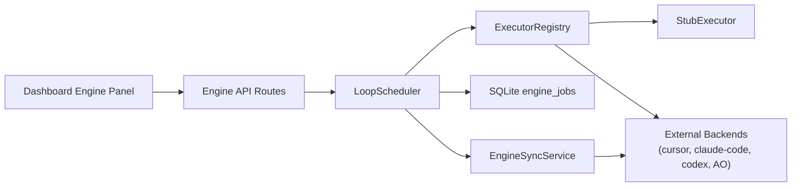
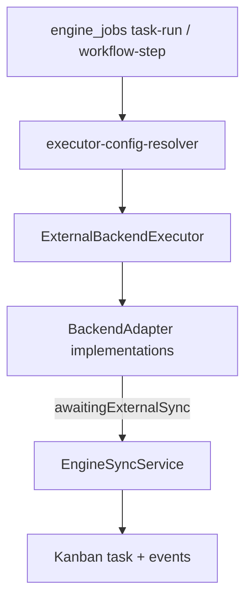
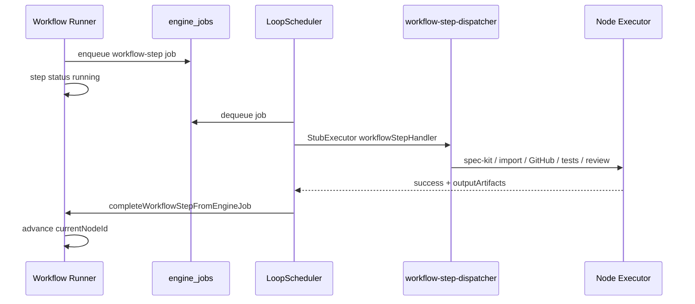
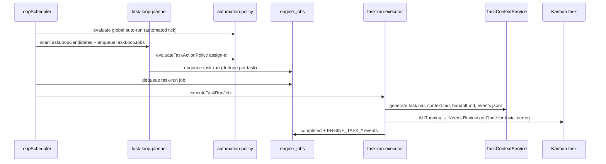
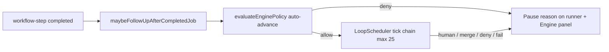

# Loop Execution Engine

Phase 01 adds a hybrid loop execution engine to Loop Control Plane. An in-app scheduler dequeues persisted jobs from SQLite, resolves a pluggable executor backend, and records redacted execution logs. Heavy work is delegated to executor implementations. Phase 03 wires the workflow graph runner in [[Workflow-Editor-Runner]] to enqueue `workflow-step` jobs that invoke real node executors (Spec Kit CLI, task import, GitHub delivery, test runs, AI review stubs) through the engine queue.

Automation gates from [[Risk-Policy]] and trusted-input boundaries from [[Security-Policy]] apply before any automated scheduler tick. Global auto-run stays off by default.

## Hybrid Architecture



| Layer | Responsibility |
|-------|----------------|
| **Dashboard panel** | Polls status, enqueues demo jobs, manual tick, start/stop scheduler |
| **API routes** | `GET /api/engine/status`, `POST /api/engine/{start,stop,tick,demo-job}` |
| **LoopScheduler** | Tick orchestration, policy checks, dequeue, finalize job state |
| **ExecutorRegistry** | Maps `(backend, jobKind)` to an `Executor` implementation |
| **SQLite** | `engine_jobs` queue + `engine_scheduler_state` singleton |
| **Background interval** | When scheduler is `running` and global auto-run is on, `POST /api/engine/start` starts process-memory ticks every 3s |

The scheduler is not a separate daemon. It runs inside the Next.js Node process and advances work only on explicit ticks (manual button, background interval, or test harness).

## Executor Backends

Backends are declared in `lib/engine/loop-engine-types.ts`:

| Backend | Status | Usage |
|---------|--------|-------|
| `stub` | **Implemented** | Default in CI; demo jobs, workflow-step dispatch, deterministic test doubles |
| `cursor` | **Implemented (Phase 04)** | Cursor CLI via audited process-runner profile |
| `claude-code` | **Implemented (Phase 04)** | Claude Code non-interactive print mode |
| `codex` | **Implemented (Phase 04)** | Codex CLI when installed; graceful `backend_unavailable` when missing |
| `agent-orchestrator` | **Implemented (Phase 04)** | AO spawn/poll handoff; see [[Agent-Orchestrator-Bridge]] |

External backends register through `ExternalBackendExecutor` and `backend-adapter-registry.ts`. Missing binaries or disabled project settings produce explainable errors (`backend_unavailable`, `executor_backend_disabled`) with human-readable reasons from availability probes and `describeAgentOrchestratorAvailability`.

### ExecutorConfig on Nodes and Task Runs

Per-step backend settings live in existing JSON `config`, not a new column:

```json
{
  "executor": {
    "backend": "stub",
    "command": "optional-command",
    "workingDirectory": "/path/to/repo",
    "timeoutMs": 60000,
    "envAllowlist": ["NODE_ENV"]
  }
}
```

Helpers `readExecutorConfig`, `validateExecutorConfig`, and `withExecutorConfig` read and validate nested `config.executor`. Invalid config produces structured validation issues for the UI and API.

### Backend resolution order

For `task-run` and `workflow-step` jobs, `resolveExecutorConfigWithFallbacks` (`lib/engine/executor-config-resolver.ts`) picks the backend in this order:

1. Explicit non-stub config on the job payload or workflow node
2. Workflow node `config.executor.backend` when non-stub
3. Task label `executor-backend:*`
4. Project default — `engineSettings.defaultTaskBackend` or `defaultReviewBackend` (review actions)
5. Global default — `stub` in CI (`LOOPBOARD_EXECUTOR_BACKEND=stub`); configurable locally via env

Project defaults persist in `project.engineSettings` (migration `0009_project_engine_settings.sql`).

## Agent Backends (Phase 04)

Phase 04 registers real external agent adapters behind the executor registry. Heavy execution runs out-of-process via audited CLI profiles in `process-runner.ts`; the in-app scheduler tracks job state, syncs outcomes to the board, and preserves human approval gates from [[Risk-Policy]] and [[Human-Takeover]].



### Adapter contract

Defined in `lib/engine/backends/backend-adapter.ts`:

| Method | Purpose |
|--------|---------|
| `checkAvailability()` | Lightweight CLI probe (`--version` or project-scoped AO checks) |
| `execute(context)` | Spawn external work; cwd constrained under project repo |
| `cancel(jobId)` | Best-effort cancellation of tracked subprocess |
| `poll?(job, context)` | Optional status poll for long-running sessions (AO) |

External backends **reject** legacy `config.command` shell strings (`assertSafeBackendConfig`). All argv is fixed per process-runner profile.

### Cursor, Claude Code, and Codex

Implemented in `cli-backend-adapters.ts` via `createCliBackendAdapter`:

| Backend | CLI profile | Prompt source |
|---------|-------------|---------------|
| `cursor` | `cursor` | Generated `task.md` + `context.md` paths (`ExecutorConfig.promptFile`) |
| `claude-code` | `claude` | `TaskContextService.generateClaudeCodePrompt` |
| `codex` | `codex` | Same path assembly as other CLI backends |

Optional `ExecutorConfig.model` passes through to CLI args when supported. Exit codes and redacted stdout tails are captured in engine logs. Missing binaries return `backend_unavailable` without crashing the scheduler.

### Agent Orchestrator

The `agent-orchestrator` adapter wraps `ao spawn`, `ao status --json`, and optional `ao send` through the `ao` process-runner profile. Full handoff semantics, `ao-ready` contract, `gh` auth requirements, and non-goals are documented in [[Agent-Orchestrator-Bridge]].

Key behaviors:

- **Single-task handoff** — Linked GitHub issue + `ao-ready` label (or policy-driven `mark-ao-ready`) before spawn; see [[GitHub-Issue-Bridge]]
- **Fan-out** — Workflow node `executor.fanOut.maxConcurrency` + `executor.fanOut.issueIds[]`; parallel spawns with dedupe by issue number
- **Poll deferral** — Job stays `running` with `awaitingExternalSync: true`; `EngineSyncService` reconciles on scheduler ticks
- **Untrusted results** — Summaries, branch labels, and PR URLs prefixed `[external/untrusted]` per [[Security-Policy]]
- **Stuck jobs** — Poll timeout marks job failed and task Blocked; AO session is **not** killed by default

### Extended ExecutorConfig fields

Backend-specific options on `config.executor`:

| Field | Type | Usage |
|-------|------|-------|
| `promptFile` | string | Repo-relative path to generated task prompt |
| `issueNumber` | number | GitHub issue for AO / issue-scoped runs |
| `branch` | string | Target branch hint |
| `fanOut` | `{ maxConcurrency, issueIds[] }` | Parallel AO spawns on workflow nodes |
| `aoProjectId` | string | AO yaml `projects:` key |
| `model` | string | Optional Cursor / Claude / Codex model id |

### Project engine settings

`project.engineSettings` (UI: project settings form):

| Field | Purpose |
|-------|---------|
| `defaultTaskBackend` | Fallback for task-run pickup |
| `defaultReviewBackend` | Fallback when `taskAction: review` |
| `agentOrchestrator.enabled` | Enable AO adapter for this project |
| `agentOrchestrator.configPath` | Repo-relative AO yaml path (validated) |
| `agentOrchestrator.projectId` | Default AO project key |
| `agentOrchestrator.dashboardUrl` | Task detail **Open AO Dashboard** link |
| `agentOrchestrator.pollIntervalMs` | External sync poll cadence |

### Availability and UI

`backend-availability-service.ts` probes installed CLIs and project AO config. Results are cached for 60 seconds and exposed at `GET /api/engine/backends/availability`. The Engine panel renders availability chips (`cursor: installed`, `ao: config missing`, etc.). The workflow editor shows backend-specific fields (model, fan-out concurrency) with a link back to this document.

### External sync service

`lib/engine/engine-sync-service.ts` runs during `LoopScheduler.tick`:

1. List running jobs with `awaitingExternalSync: true`
2. Call adapter `poll()` (AO) or honor timeout deadline
3. On terminal status — transition task to Needs Review or Blocked; append `ENGINE_EXTERNAL_SYNC` events
4. When AO reports `prUrl`, call `syncGitHubPullRequest` to attach PR metadata (still untrusted)
5. On timeout — fail job, Block task, leave external session running

Dashboard engine status polling (every 3s) refreshes board data when external jobs complete.

### Verification

All external CLI invocations are mocked in CI (`tests/backend-adapters.test.ts`, `tests/agent-orchestrator-backend.test.ts`, `tests/engine-sync-service.test.ts`). Optional local walkthrough when CLIs are installed: enqueue a Ready task with **Run with Engine** per backend and confirm board transitions; otherwise rely on mocked test suites.

See [[Agent-Orchestrator-Bridge]] for AO-specific walkthrough notes and [[GitHub-Issue-Bridge]] for issue/label prerequisites.

## Job Lifecycle

### Job kinds

| Kind | Usage |
|------|-------|
| `demo-ping` | Dashboard **Run Demo Job** — stub backend smoke test |
| `task-run` | **Implemented (Phase 02)** — task-scoped executor runs with context handoff |
| `workflow-step` | **Implemented (Phase 03)** — bridge from workflow runner to node executors |

### Job statuses

`queued` → `running` → `completed` | `failed` | `cancelled`

1. **Enqueue** — `createEngineJob` inserts a row with `status: queued`, `attempt: 1`, and initial execution logs.
2. **Tick plan** — `planNextTick` checks scheduler state, global automation policy (for automated ticks), and whether a queued job exists.
3. **Dequeue** — `fetchNextQueuedJob` returns the oldest eligible job (FIFO by `queued_at`).
4. **Execute** — Job marked `running`; registry resolves executor; `execute` returns stdout/stderr summaries and log entries.
5. **Finalize** — `processEngineJob` sets `completed` on success, or increments `attempt` and requeues when under `maxAttempts`, otherwise `failed` with redacted error text.

### Scheduler states

| State | Meaning |
|-------|---------|
| `stopped` | Default on boot; no automatic ticks |
| `running` | Accepts automated ticks when global auto-run is enabled |
| `paused` | Skips automated ticks until resumed |

Transitions: `start`, `stop`, `pause` via `applySchedulerTransition` and `LoopScheduler` service methods.

### Retry semantics

Failed executor results increment `attempt`. When `attempt < maxAttempts`, the job returns to `queued` with a retry log entry. Otherwise it stays `failed` with redacted error text in `error` and execution logs.

## Policy Gates

Engine behavior follows `lib/policies/automation-policy.ts`:

| Action | Global auto-run off | Global auto-run on |
|--------|---------------------|---------------------|
| **Run Demo Job** (`POST /api/engine/demo-job`) | Allowed | Allowed |
| **Tick Once** (`POST /api/engine/tick`, manual mode) | Allowed | Allowed |
| **Start Scheduler** (`POST /api/engine/start`) | **403** — policy deny | Allowed; starts background interval |
| **Automated tick** (background interval) | Skipped — policy deny | Allowed when scheduler is `running` |

`evaluateGlobalAutomationPolicy` returns `deny` with code `global_auto_run_disabled` when `globalAutoRunEnabled` is false. The dashboard **Start Scheduler** button is disabled and shows `describeEffectiveAutomationPolicy` reasons.

Manual ticks bypass the global policy gate so developers can exercise the engine without enabling background automation.

## Log Redaction

Engine logs pass through `redactEngineLogEntry` and `redactSensitiveText` (`lib/security/safe-context.ts`), matching patterns used by the workflow runner: tokens, secrets, passwords, bearer values, and api-key-shaped strings are replaced before persistence and API responses.

## Persistence

Migration `db/migrations/0008_loop_engine.sql` adds:

- **`engine_jobs`** — job queue with JSON `payload`, `result`, and `execution_logs`; optional FKs to projects, tasks, and workflow runs; indexes on `status`, `(status, queued_at)`, and project lookups.
- **`engine_scheduler_state`** — singleton row `id = 'default'`; initialized to `stopped` with `tick_count = 0`.

`LoopBoardRepository` exposes create/list/get/update job methods, `appendEngineLogEntry`, `fetchNextQueuedJob`, and scheduler read/update helpers. Seed data includes one completed historical `demo-ping` job for dashboard display; the scheduler is **not** auto-started on boot.

## API and Client Helpers

| Route | Method | Purpose |
|-------|--------|---------|
| `/api/engine/status` | GET | Scheduler state, queue counts by status, latest 10 jobs (redacted summaries), automation policy |
| `/api/engine/start` | POST | Start scheduler + background ticks (requires global auto-run) |
| `/api/engine/stop` | POST | Stop scheduler + clear background interval |
| `/api/engine/tick` | POST | Single tick; body `{ mode?: "manual" \| "automated" }` |
| `/api/engine/demo-job` | POST | Enqueue stub `demo-ping` for `{ projectId }` |

Typed client helpers in `lib/api/loopboard-client.ts`: `fetchEngineStatus`, `startEngineScheduler`, `stopEngineScheduler`, `tickEngine`, `enqueueEngineDemoJob`.

## Dashboard Engine Panel

The **Loop Engine** panel on the project dashboard (`app/page.tsx`) shows:

- Scheduler status badge (`stopped` / `running` / `paused`)
- Queue depth and last tick time
- Active backend from the most recent job
- Recent job rows with status badges and last log message

Controls: **Run Demo Job**, **Tick Once**, **Start Scheduler**, **Stop Scheduler**. Status polls every 3 seconds while the dashboard is open.

The workflow runner panel also shows the latest engine job for the current workflow step and exposes **Run Next Step (Engine)** when global auto-run is off (see [[Workflow-Editor-Runner]]).

## Workflow Executors

Phase 03 connects the graph runner to the engine queue. When automation policy allows (including after human approval on semi nodes), `runNextWorkflowStep` enqueues `workflow-step` jobs instead of completing automatable nodes inline. Steps enter `running` status until `LoopScheduler.tick` finishes the job and calls `completeWorkflowStepFromEngineJob`, which links artifacts, appends feature/task events, and advances the graph (including conditional edges via `branchLabel` from executors such as `ai-review`).



| Node type | Executor module | Reuses |
|-----------|-----------------|--------|
| `spec-kit-actions` | `lib/engine/executors/spec-kit-actions-executor.ts` | Spec Kit CLI via `process-runner` |
| `import-tasks` | `lib/engine/executors/import-tasks-executor.ts` | [[Spec-Kit-Importer]] |
| `create-github-issues` | `lib/engine/executors/create-github-issues-executor.ts` | [[GitHub-Issue-Bridge]] |
| `open-pr` | `lib/engine/executors/open-pr-executor.ts` | [[GitHub-Issue-Bridge]] PR helpers |
| `run-tests` | `lib/engine/executors/run-tests-executor.ts` | `process-runner` npm-test profile |
| `ai-review` | `lib/engine/executors/ai-review-executor.ts` | Stub review backend; `branchLabel` for edges |

Approval-gate nodes (`human-input`, `human-review`, `manual-claude-code-edit`, `merge`) still pause for operator approval. Executors prepare context but never bypass `evaluateWorkflowNodePolicy`. External and GitHub-derived artifacts are tagged `[external/untrusted]` per [[Security-Policy]].

Subprocess safety (allowlisted commands, cwd validation, timeouts, redacted logs) lives in `lib/engine/process-runner.ts`. Full node mapping, config schema, and editor UI are documented in [[Workflow-Node-Executors]].

Verification: `npm run db:migrate`, `npm run lint`, `npm run typecheck`, and `npm test`. Feature Development Loop walkthrough coverage lives in `tests/workflow-executor-verification.test.ts` (human-input → spec-kit-actions with mocked CLI → human-review → import-tasks, confirming board tasks and workflow events). External backend coverage: `tests/backend-adapters.test.ts`, `tests/agent-orchestrator-backend.test.ts`, `tests/engine-sync-service.test.ts`.

## Task Loop

Phase 02 wires the engine to the Kanban board so Ready tasks can be picked up automatically, given generated context, executed through a configured backend, and advanced without manual clicks. The loop honors [[Risk-Policy]] gates, [[Human-Takeover]] semantics (`ai-paused`, human owner claims), and conservative defaults.



### Eligibility and policy gates

The planner (`lib/engine/task-loop-planner.ts`) scans board tasks and enqueues `task-run` jobs only when all of the following hold:

| Gate | Rule |
|------|------|
| **Status** | Task is in the Ready column (`status: ready`) |
| **Owner** | `unassigned` or `ai` — human-owned or pairing tasks are skipped |
| **Human takeover** | No `ai-paused` label (active [[Human-Takeover]]) |
| **Risk policy** | `evaluateTaskActionPolicy({ action: "assign-ai", automated })` returns `allow` |
| **Low-risk auto execution** | When `automated: true`, project `allowLowRiskAutoTaskExecution` must be enabled (default **false**) |
| **AO-ready approval** | Medium/high/critical tasks require `aoReadyApprovedAt` unless risk policy allows otherwise |
| **Dedupe** | No queued or running `task-run` job for the same task id |

Skipped candidates append `ENGINE_PICKUP_SKIPPED` events with explainable policy codes. Manual **Run with Engine** uses `automated: false` and bypasses the global auto-run gate but still evaluates task-level risk and approval rules.

### Scheduler integration

On each **automated** tick when the scheduler is `running` and global auto-run is enabled, `planTaskLoopPickup` enqueues eligible tasks up to `DEFAULT_TASK_LOOP_CONCURRENCY_LIMIT` (1). When global auto-run is off or the scheduler is stopped, automated pickup is skipped; operators can still enqueue a selected task manually from the task detail panel or `POST /api/engine/task-loop/enqueue`.

Project automation settings expose **Allow low-risk auto task execution** (`allowLowRiskAutoTaskExecution`, default false). High/critical risk tasks never auto-execute without explicit approval per [[Risk-Policy]].

### Execution lifecycle

`task-run-executor.ts` handles `task-run` jobs registered via `taskRunHandler` in `createExecutorRegistryForRepository`:

1. **Pickup** — Refresh context files via `TaskContextService`; transition task to AI Running; append `ENGINE_PICKUP` and `ASSIGNED_TO_AI` events.
2. **Backend resolution** — Payload `executorConfig` → task `executor-backend:*` label → workflow node config → project `engineSettings.defaultTaskBackend` → global default (`stub` in CI). See **Agent Backends (Phase 04)** and `executor-config-resolver.ts`.
3. **Invoke** — `ExternalBackendExecutor` dispatches to registered `BackendAdapter` implementations (Cursor, Claude Code, Codex, AO, or stub).
4. **Success** — Move to Needs Review (or Done for tasks labeled `engine-trivial`); append `ENGINE_TASK_COMPLETED`; refresh handoff with result summary.
5. **Failure** — Retry while `attempt < maxAttempts` (task stays AI Running); otherwise Blocked with `ENGINE_TASK_FAILED` and redacted error text.

### API and UI

| Route | Method | Purpose |
|-------|--------|---------|
| `/api/engine/task-loop/scan` | POST | Dry-run planner — returns eligible tasks and skip reasons |
| `/api/engine/task-loop/enqueue` | POST | Manual enqueue for `{ taskId }` with policy evaluation response |

Client helpers: `scanTaskLoop`, `enqueueTaskLoop` in `lib/api/loopboard-client.ts`.

The task detail **Engine Status** panel shows the latest job id, backend, attempt, last log line, and **Run with Engine** when policy allows. Kanban cards show **engine queued** / **engine running** badges for in-flight jobs. The dashboard polls engine status every 3 seconds and refreshes board data when a `task-run` job completes.

### Verification

End-to-end coverage: `tests/task-loop-integration.test.ts` seeds a low-risk Ready task, enables global auto-run and `allowLowRiskAutoTaskExecution`, ticks the scheduler, and asserts Ready → AI Running → Needs Review with on-disk context artifacts. Planner, executor, scheduler, and policy unit tests live in `tests/task-loop-planner.test.ts`, `tests/task-run-executor.test.ts`, `tests/loop-scheduler.test.ts`, and `tests/automation-policy.test.ts`.

**Manual walkthrough:** Enable global auto-run in dashboard automation settings, enable **Allow low-risk auto task execution** on the project, click **Start Scheduler**, and confirm a seeded Ready low-risk task (e.g. `task-local-persistence-reset`) moves to AI Running then Needs Review with engine badges updating. Disable global auto-run and confirm automated pickup stops while **Run with Engine** remains available on eligible tasks.

## Key Source Files

| Path | Role |
|------|------|
| `lib/engine/loop-engine-types.ts` | Domain types, executor config validation |
| `lib/engine/executor-registry.ts` | `Executor` interface, `StubExecutor`, registry |
| `lib/engine/loop-scheduler.ts` | Tick orchestration, pure test helpers |
| `lib/engine/scheduler-interval.ts` | Process-memory background tick interval |
| `lib/api/engine-actions.ts` | Status aggregation and route action handlers |
| `app/api/engine/**` | HTTP route handlers |
| `lib/engine/executors/workflow-step-dispatcher.ts` | Routes `workflow-step` jobs to node executors |
| `lib/engine/process-runner.ts` | Audited subprocess execution for CLIs |
| `lib/workflows/workflow-runner.ts` | Graph state machine; enqueues engine jobs |
| `tests/loop-engine-*.test.ts` | Types, scheduler, repository, API coverage |
| `lib/engine/task-loop-planner.ts` | Eligibility scan, policy evaluation, task-run enqueue |
| `lib/engine/task-run-executor.ts` | Context generation, backend invoke, board transitions |
| `lib/api/task-loop-actions.ts` | Scan/enqueue API action handlers |
| `app/api/engine/task-loop/**` | Task loop HTTP routes |
| `tests/task-loop-*.test.ts` | Planner, executor, and integration coverage |
| `tests/workflow-engine-integration.test.ts` | Trimmed import-tasks → create-github-issues engine path |
| `tests/workflow-executor-verification.test.ts` | Feature Development Loop full walkthrough verification |
| `tests/loop-full-verification.test.ts` | High-risk pickup and merge hard-stop policy confirmation |
| `tests/loop-engine-auto-advance.test.ts` | Chained auto-advance and pause semantics |
| `tests/loop-engine-recovery.test.ts` | Operator retry, cancel, and resume flows |
| `tests/loop-engine-observability.test.ts` | Job API filters, redaction, and metrics |
| `lib/engine/auto-advance.ts` | Workflow auto-advance orchestration after engine jobs |
| `lib/engine/auto-advance-ui.ts` | Client-safe pause reason extraction for dashboard panels |
| `lib/engine/task-loop-eligibility.ts` | Client-safe structural task pickup eligibility checks |
| `lib/engine/engine-job-recovery.ts` | Retry, cancel, and workflow resume operator actions |
| `lib/engine/backends/backend-adapter.ts` | External adapter contract and cwd validation |
| `lib/engine/backends/cli-backend-adapters.ts` | Cursor, Claude Code, Codex CLI adapters |
| `lib/engine/backends/agent-orchestrator-backend.ts` | AO spawn, fan-out, poll |
| `lib/engine/backends/agent-orchestrator-config.ts` | AO project settings and ao-ready handoff |
| `lib/engine/engine-sync-service.ts` | External job poll reconciliation and PR attach |
| `lib/engine/executor-config-resolver.ts` | Backend fallback resolution order |
| `lib/engine/backends/backend-availability-service.ts` | Cached CLI/AO availability for UI |
| `tests/backend-adapters.test.ts` | CLI adapter success, unavailable, timeout, redaction |
| `tests/agent-orchestrator-backend.test.ts` | AO spawn, fan-out, poll mapping |
| `tests/engine-sync-service.test.ts` | Board sync, untrusted summaries, PR URL attach |

## Intentional Non-Goals (remaining)

- **No global auto-run by default** — Operators must explicitly enable automation before the scheduler runs unattended.
- **No distributed queue** — Single-process SQLite queue; no Redis, no multi-instance coordination.
- **No auto-merge from external backends** — AO and CLI results remain untrusted until human review; see [[Human-Takeover]] and [[Security-Policy]].

Real agent CLI backends (Cursor, Claude Code, Codex, Agent Orchestrator) are implemented in Phase 04. See **Agent Backends (Phase 04)** and [[Agent-Orchestrator-Bridge]].

## Auto-Advance (Phase 05)

When both **global auto-run** and project **`engineSettings.autoAdvanceEnabled`** are enabled, the scheduler chains workflow progression after each successful `workflow-step` job without requiring manual **Run Next Step** clicks.



| Gate | Behavior |
|------|----------|
| **Global auto-run off** | Auto-advance skipped; manual ticks and **Run Next Step (Engine)** still work |
| **Project auto-advance off** (default) | Workflow runs pause after each engine step until operator resumes |
| **`requires-approval` semi nodes** | Pause with policy code; operator approves then engine enqueues |
| **`merge`, `manual-claude-code-edit`, human nodes** | Hard stop — never auto-executes even when auto-advance is on |
| **Policy deny (high/critical risk)** | Stop with explainable pause reason |
| **Failed step** | Run status `failed` or `paused`; operator uses **Retry** / **Resume Run** |

Implementation: `lib/engine/auto-advance.ts` (`maybeAutoAdvanceWorkflowRun`, `maybeFollowUpAfterCompletedJob`), UI pause summaries in `lib/engine/auto-advance-ui.ts`, chained ticks in `LoopScheduler` (max 25 per start/tick). Project setting: **Enable workflow auto-advance** on the dashboard project form.

## Observability (Phase 05)

Operators inspect engine activity from the dashboard **Loop Engine** panel and project metrics without external telemetry.

| Surface | Route / module | Purpose |
|---------|----------------|---------|
| **Job list** | `GET /api/engine/jobs` | Filter by project, task, workflow run, node, status, backend |
| **Job detail** | `GET /api/engine/jobs/[jobId]` | Full redacted execution log timeline, payload summary, attempts, linked task/workflow node |
| **Job drawer** | Engine panel UI | Expandable detail: stdout/stderr excerpts, policy decisions, external session ids |
| **Project metrics** | `getEngineJobMetrics` | Jobs queued/running/completed/failed in last 24h, average duration, failure rate (SQLite) |
| **Active jobs badge** | Workflow health header | Count of queued + running jobs next to global auto-run indicator |
| **Operator controls** | `POST .../retry`, `.../cancel`, `.../engine-resume` | Retry failed jobs, cancel in-flight work, resume paused workflow runs — disabled with policy tooltips when blocked |

Log redaction and secret regression coverage mirror [[Security-Policy]] (`tests/loop-engine-security.test.ts`, `tests/loop-engine-observability.test.ts`). Recovery semantics: `lib/engine/engine-job-recovery.ts`.

## Verification (Phase 05)

Full loop verification runs in CI with mocked external CLIs and GitHub APIs:

| Walkthrough | Test file | Coverage |
|-------------|-----------|------------|
| **Feature Development Loop** | `tests/workflow-executor-verification.test.ts` | human-input → spec-kit-actions → human-review → import-tasks → create-github-issues (mocked) → agent-orchestrator-implement → run-tests → ai-review → open-pr (mocked) → merge gate pause; board tasks + workflow events at each stage |
| **Task loop** | `tests/task-loop-integration.test.ts` | Ready low-risk task → engine pickup → stub backend → Needs Review with on-disk context |
| **Policy gates** | `tests/loop-full-verification.test.ts` | High-risk Ready tasks blocked from automated pickup; merge node never auto-advances |
| **Auto-advance** | `tests/loop-engine-auto-advance.test.ts` | Chained progression, pause on human node, deny on high-risk |
| **Recovery** | `tests/loop-engine-recovery.test.ts` | Retry/cancel/resume, idempotent import/GitHub retries |
| **Observability** | `tests/loop-engine-observability.test.ts` | Job filters, redacted detail, dashboard metrics |
| **Engine panel UI** | `tests/ui/loop-engine-panel.spec.ts` | Panel visibility, demo job + drawer, auto-run disabled default |

**CI commands:** `npm run db:migrate`, `npm run lint`, `npm run typecheck`, `npm test`, `npm run test:ui`.

Client bundles import only UI-safe engine helpers (`task-loop-eligibility.ts`, `auto-advance-ui.ts`) so Playwright can load the dashboard without pulling `node:child_process` into the webpack graph.

## Related Documents

- [[Workflow-Editor-Runner]] — graph runner, approval gates, runner panel engine controls
- [[Workflow-Node-Executors]] — per-node executor modules, process runner, config schema
- [[Spec-Kit-Importer]] — task import reuse for `import-tasks` workflow steps
- [[GitHub-Issue-Bridge]] — issue and PR helpers for delivery nodes
- [[Agent-Orchestrator-Bridge]] — AO handoff flow, ao-ready contract, fan-out, non-goals
- [[Risk-Policy]] — global auto-run defaults and risk gates
- [[Human-Takeover]] — ai-paused and human owner semantics for task pickup
- [[Security-Policy]] — token handling and trusted-input rules
- [[loop-engine-execution-boundaries]] — Phase 01 inspection notes on reuse boundaries
